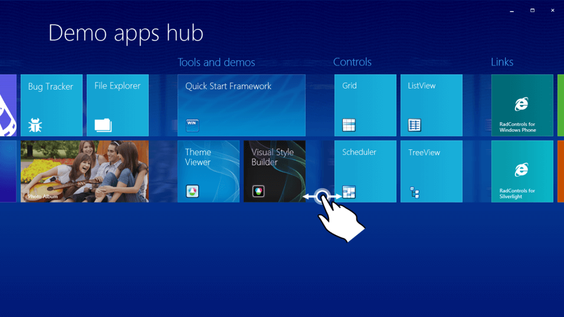
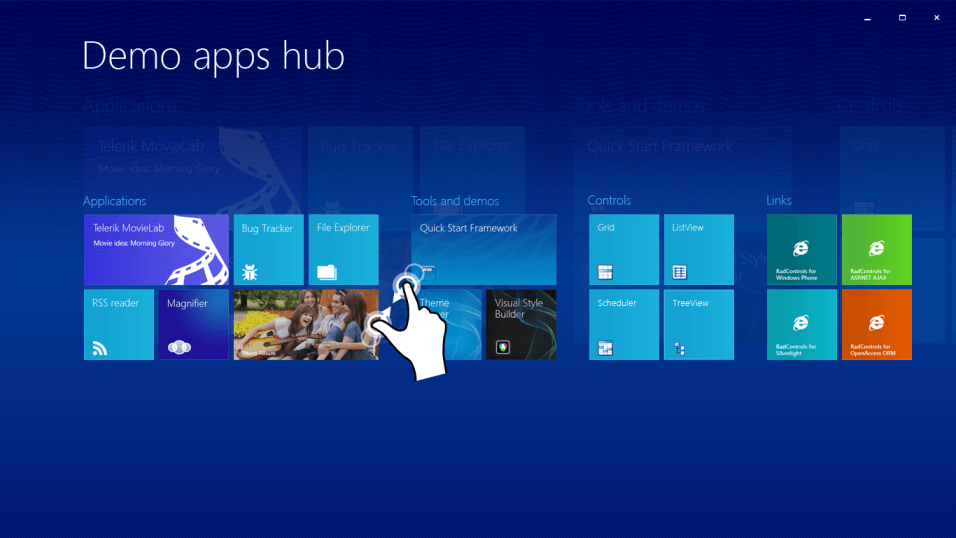
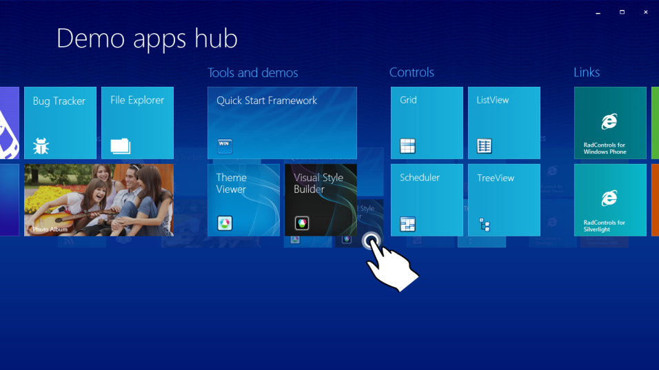
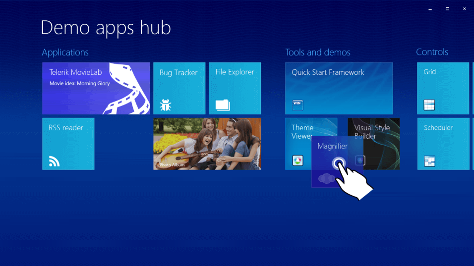

# Touch Support

**RadPanorama** supports scrolling and dragging via touch.

## Scrolling

Touch scrolling support allows your end-users to smoothly scroll the displayed tiles left or right. You do not need to look for a scroll bar as the pan operation can occur directly on the tiles: 

## Touch Zoom in/Zoom out

This multi-touch feature allows you to see all tiles at once by pinching (zooming out) the initial view. 

After you find the desired tile in the zoomed-out list of tiles, you should just tap it and **RadPanorama** will zoom in the corresponding part of the list.

## Reordering Tiles

The end-user is allowed to reorder the tiles according to his/her preferences with a single gesture. An outline of the dragged tile is displayed to the user to indicate that a drag’n’drop operation is currently occurring. In addition, the remaining tiles are moved out of the way according to the finger position to indicate the possible drop target.

# See Also

* [Windows Touch Gestures](http://msdn.microsoft.com/en-us/library/windows/desktop/dd940543(v=vs.85).aspx)
