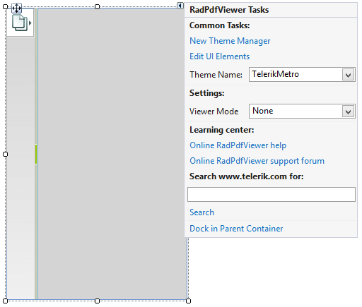

# Design Time

>caption Figure 1: Smart Tag

* __Common Tasks__

	* __New Theme Manager__: Adds a new __RadThemeManager__ component to the form.

	* __Edit UI elements__: Opens a dialog that displays the *Element Hierarchy Editor*. This editor lets you browse all the elements in the control.

	* __Theme Name__: Select a theme name from the drop down list of themes available for that control. Selecting a theme allows you to change all aspects of the controls visual style at one time.

* __Settings__

	* __Viewer Mode__: Specifies the behavior of __RadPdfViewer__ when you left-click in the document and drag across the document:
	  *  *None*: The document can be scrolled only with the mouse wheel or directly using the scrollbars.
	  *  *Pan*: The document is scrolled in the respective direction.
	  *  *TextSelection*: Selection is initiated, which stops when you release the button of the mouse.

* __Learning Center__: Navigate to the Telerik help, code library projects or support forum.

* __Search__: Search the Telerik website for a given string.

# See Also

* [Logical Structure]()
* [Visual Structure]()
* [Getting Started]()
* [Element Hierarchy Editor]()

