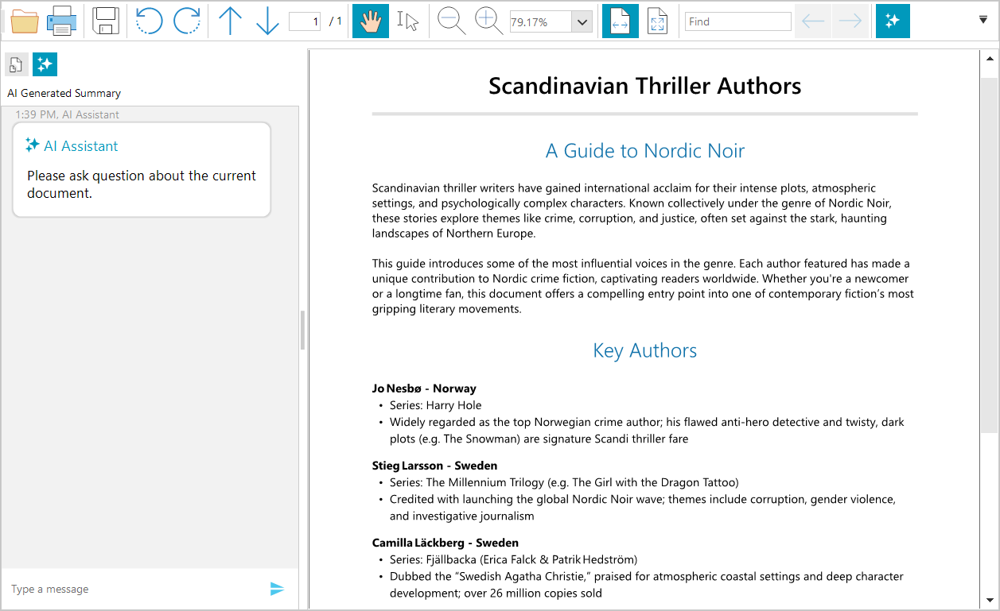
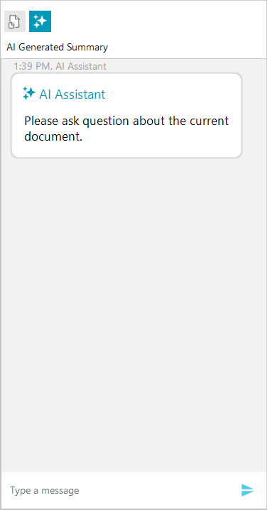

# AI Summarization for RadPdfViewer

RadPdfViewer provides a smart summarization feature that allows you to use Large Language Models (LLMs) services to analyze the content of the PDF document. This functionality allows you to summarize document content and ask questions about the document, with the AI providing relevant answers based on the document's content.

The AI summarization feature is accessible through an integrated chat interface within the RadPdfViewer component. You can connect the RadPdfViewer to supported AI services to enable document analysis and summarization capabilities. The integrated chat interface allows users to enter custom prompts and receive AI-generated responses based on the PDF document content.



## Required NuGet Packages

The summarization feature requires the installation of several additional packages beyond those needed for the RadPdfViewer control.

### Required Packages

```XML
<ItemGroup>
 <PackageReference Include="Azure.AI.OpenAI" Version="2.2.0-beta.2" />
 <PackageReference Include="Microsoft.Extensions.AI.OpenAI" Version="9.3.0-preview.1.25161.3" />
 <PackageReference Include="OllamaSharp" Version="5.4.8" />
 <PackageReference Include="Telerik.UI.for.WinForms.AllControls" Version="2025.4.1111" />
 <PackageReference Include="Telerik.Licensing" Version="1.6.31" />
 <PackageReference Include="Telerik.Windows.Documents.Fixed" Version="2025.4.1104*" />
 <PackageReference Include="Telerik.Windows.Documents.Core" Version="2025.4.1104*" />
 <PackageReference Include="Telerik.Windows.Documents.AIConnector" Version="*2025.4.1104" />
</ItemGroup>
```

### Using Assembly References

The recommended installation approach is to use the Telerik NuGet packages, but in case you cannot do this, the following list shows the required `.dll` files.

* `Telerik.Documents.AI.Core.dll`
* `Telerik.Documents.AI.RAG.dll`
* `Telerik.Windows.Documents.AIConnector.dll`
* `Telerik.Windows.Documents.Core.dll`
* `Telerik.Windows.Documents.Fixed.dll`
* `Telerik.Licensing.Runtime.dll`
* `Telerik.WinControls.dll`
* `Telerik.WinControlsUI.dll`
* `Telerik.Common.dll`
* `TelerikData.dll`


## Showing the AI Summarization UI

The AI summarization is represented by a RadChat component that allows you to craft prompts and recieve reponses from the corresponding AI service. To enable it, set the `EnableAISummary` property to `true`. This will include an extra tab on the left part in the navigation pane in RadPdfViewer. Additionally, the **RadPdfViewerNavigator** shows a button that can be used to quickly show/hide the AI summarization feature directly from the UI. 

````C#
this.radPdfViewer1.EnableAISummary = true;

````
````VB.NET
Me.RadPdfViewer1.EnableAISummary = True

````



## Setting up the AI Provider

To connect the chat to an AI service, one of the built-in providers can be used. This setting is configured through the `PdfViewerElement` property. All available AI providers implement the `ISummaryProvider` interface.

The following AI providers are available for integration with RadPdfViewer:

* [Azure OpenAI Provider](#using-azure-openai-provider) — Integrates with Microsoft Azure's OpenAI services with powerful AI capabilities.
* [OpenAI Provider](#using-openai-provider) — Connects directly to OpenAI's API services for AI-powered document analysis.
* [Ollama AI Provider](#using-ollama-ai-provider-local-ai)—Enables the use of local AI models through Ollama.
* [Custom Summary Provider](#implementing-custom-summary-provider) — Allows you to implement custom summarization behavior by creating your own provider.

````C#
this.radPdfViewer1.PdfViewerElement.SummaryProvider = aiSummaryProvider;

````
````VB.NET
Me.RadPdfViewer1.PdfViewerElement.SummaryProvider = aiSummaryProvider

````

### Using Azure OpenAI Provider

To enable the Azure OpenAI services, use the `AzureOpenAISummaryProvider` class. 

````C#
// Azure OpenAI Summary Provider example
string key = "your-azure-openai-key";
SecureString secureKey = new SecureString();
foreach (char c in key)
{
    secureKey.AppendChar(c);
}

string endpoint = "https://your-resource-name.openai.azure.com/";
string model = "model-name"; //ex: "gpt-4o-mini"
var azureOpenAIprovider = new Telerik.WinControls.UI.AIProviders.AzureOpenAISummaryProvider(secureKey, endpoint, model);
this.radPdfViewer1.PdfViewerElement.SummaryProvider = azureOpenAIprovider;

````
````VB.NET
' Azure OpenAI Summary Provider example
Dim key As String = "your-azure-openai-key"
Dim secureKey As New SecureString()
For Each c As Char In key
    secureKey.AppendChar(c)
Next

Dim endpoint As String = "https://your-resource-name.openai.azure.com/"
Dim model As String = "model-name" ' ex: "gpt-4o-mini"
Dim azureOpenAIprovider = New Telerik.WinControls.UI.AIProviders.AzureOpenAISummaryProvider(secureKey, endpoint, model)
Me.radPdfViewer1.PdfViewerElement.SummaryProvider = azureOpenAIprovider

````

### Using OpenAI Provider

To enable the OpenAI services, use the `OpenAISummaryProvider` class. 

````C#
// Using OpenAI Provider
string key = "your-openai-key";
SecureString secureKey = new SecureString();
foreach (char c in key)
{
    secureKey.AppendChar(c);
}

string model = "model-name"; //ex: "gpt-4o-mini"

var openAIprovider = new Telerik.WinControls.UI.AIProviders.OpenAISummaryProvider(secureKey, model);
this.radPdfViewer1.PdfViewerElement.SummaryProvider = openAIprovider;

````
````VB.NET
' Using OpenAI Provider
Dim key As String = "your-openai-key"
Dim secureKey As New SecureString()
For Each c As Char In key
    secureKey.AppendChar(c)
Next

Dim model As String = "model-name" ' ex: "gpt-4o-mini"

Dim openAIprovider = New Telerik.WinControls.UI.AIProviders.OpenAISummaryProvider(secureKey, model)
Me.radPdfViewer1.PdfViewerElement.SummaryProvider = openAIprovider

````

### Using Ollama AI Provider (Local AI)

To use a local Ollama AI model, utilize the `LlamaSummaryProvider` class. 

````C#
//Use Ollama Provider
string endpoint = "localhost server"; //ex: "http://localhost:11434/"
string model = "model-name"; //ex: "llama3"

var ollamaProvider = new Telerik.WinControls.UI.AIProviders.LlamaSummaryProvider(endpoint, model);
this.radPdfViewer1.PdfViewerElement.SummaryProvider = ollamaProvider;

````
````VB.NET
' Use Ollama Provider
Dim endpoint As String = "localhost server" ' ex: "http://localhost:11434/"
Dim model As String = "model-name" ' ex: "llama3"

Dim ollamaProvider = New Telerik.WinControls.UI.AIProviders.LlamaSummaryProvider(endpoint, model)
Me.radPdfViewer1.PdfViewerElement.SummaryProvider = ollamaProvider

````

### Implementing Custom Summary Provider

In addition to the built-in providers, you can implement custom summarization provider by implementing the `ISummaryProvider` interface. 

#### Basic example of custom summary provider implementation

````C#
public class CustomSummaryProvider : ISummaryProvider
{
    private string promptAddition = string.Empty;
    public string PromptAddition { get => promptAddition; set => promptAddition = value; }

    public string AskQuestion(string question, SimpleTextDocument simpleDocument)
    {
        string documentText = simpleDocument.Text;
        // implement custom logic here
        return "An answer based on the question and the documentText";
    }

    public string GetSummary(SimpleTextDocument simpleDocument)
    {
        string documentText = simpleDocument.Text;
        // implement custom summarizaiton logic here
        return "An answer based on the documentText";
    }
}

````
````VB.NET
Public Class CustomSummaryProvider
    Implements ISummaryProvider

    Private promptAddition As String = String.Empty
    Public Property PromptAddition As String Implements ISummaryProvider.PromptAddition
        Get
            Return promptAddition
        End Get
        Set(value As String)
            promptAddition = value
        End Set
    End Property

    Public Function AskQuestion(question As String, simpleDocument As SimpleTextDocument) As String Implements ISummaryProvider.AskQuestion
        Dim documentText As String = simpleDocument.Text
        ' implement custom logic here
        Return "An answer based on the question and the documentText"
    End Function

    Public Function GetSummary(simpleDocument As SimpleTextDocument) As String Implements ISummaryProvider.GetSummary
        Dim documentText As String = simpleDocument.Text
        ' implement custom summarizaiton logic here
        Return "An answer based on the documentText"
    End Function
End Class

````

### Get Summary Programmatically

To retrieve a document summarization programmatically, use the `GetSummary` method of the corresponding AI provider.

````C#
var textDoc = this.radPdfViewer1.Document.ToSimpleTextDocument(null);
var summaryProvider = this.radPdfViewer1.PdfViewerElement.SummaryProvider;
Task.Run(() =>
{
    string summary = summaryProvider.GetSummary(textDoc);

    // this is required only if you want to update the WinForms UI with the result
    Application.Current.Dispatcher.Invoke(() =>
    {
        // update the UI if needed
    });
});

````
````VB.NET
Dim textDoc = Me.radPdfViewer1.Document.ToSimpleTextDocument(Nothing)
Dim summaryProvider = Me.radPdfViewer1.PdfViewerElement.SummaryProvider
Task.Run(Sub()
        Dim summary As String = summaryProvider.GetSummary(textDoc)

        ' this is required only if you want to update the WinForms UI with the result
        Application.Current.Dispatcher.Invoke(Sub()
        ' update the UI if needed
        End Sub)
    End Sub)

````

### Append Additional Instructions

You can customize the AI behavior by setting the `PromptAddition` property of the provider. This property allows you to append additional instructions to the prompt, which will be applied during both summarization and question-answering operations. The following example demonstrates how to configure the AI provider to deliver a concise summary translated into Bulgarian.

````C#
var summaryProvider = this.radPdfViewer1.PdfViewerElement.SummaryProvider;
summaryProvider.PromptAddition = "Be concise and translate the summary to Bulgarian.";

````
````VB.NET
Dim summaryProvider = Me.radPdfViewer1.PdfViewerElement.SummaryProvider
summaryProvider.PromptAddition = "Be concise and translate the summary to Bulgarian."

````

### SummaryResourcesCalculated Event 

The summary providers also expose an event called `SummaryResourcesCalculated`, which is invoked before the actual summarization process begins (after the `GetSummary` method is called). This event provides information about the estimated resource usage. The `SummaryResourcesCalculatedEventArgs` exposes the following properties: 

* `EstimatedCallsRequired`&mdash;Gets the number of API calls required.
* `EstimatedTokensRequired`&mdash;Gets the number of tokens to be processed.
* `ShouldContinueExecution`&mdash;A boolean flag indicating whether to proceed with summarization. The default value is `true`.

````C#
var summaryProvider = this.radPdfViewer1.PdfViewerElement.SummaryProvider;
var baseProvider = summaryProvider as BaseSummaryProvider;
baseProvider.SummaryResourcesCalculated += this.BaseProvider_SummaryResourcesCalculated;

private void BaseProvider_SummaryResourcesCalculated(object sender, Windows.Documents.AIConnector.SummaryResourcesCalculatedEventArgs e)
{
    //cancel the summarization process, if needed
    e.ShouldContinueExecution = false;

}

````
````VB.NET
Dim summaryProvider = Me.radPdfViewer1.PdfViewerElement.SummaryProvider
Dim baseProvider = TryCast(summaryProvider, BaseSummaryProvider)
AddHandler baseProvider.SummaryResourcesCalculated, AddressOf Me.BaseProvider_SummaryResourcesCalculated

Private Sub BaseProvider_SummaryResourcesCalculated(sender As Object, e As Windows.Documents.AIConnector.SummaryResourcesCalculatedEventArgs)
    'cancel the summarization process, if needed
    e.ShouldContinueExecution = False
End Sub

````

### Adjusting the Max Number of Tokens

The maximum number of tokens allowed can be set using the `MaxTokenCount` property of the summary provider. The default value is 128000.

````C#
var azureOpenAIprovider = new Telerik.WinControls.UI.AIProviders.AzureOpenAISummaryProvider(secureKey, endpoint, model);
azureOpenAIprovider.MaxTokenCount = 1000;

````
````VB.NET
Dim azureOpenAIprovider = New Telerik.WinControls.UI.AIProviders.AzureOpenAISummaryProvider(secureKey, endpoint, model)
azureOpenAIprovider.MaxTokenCount = 1000

````

