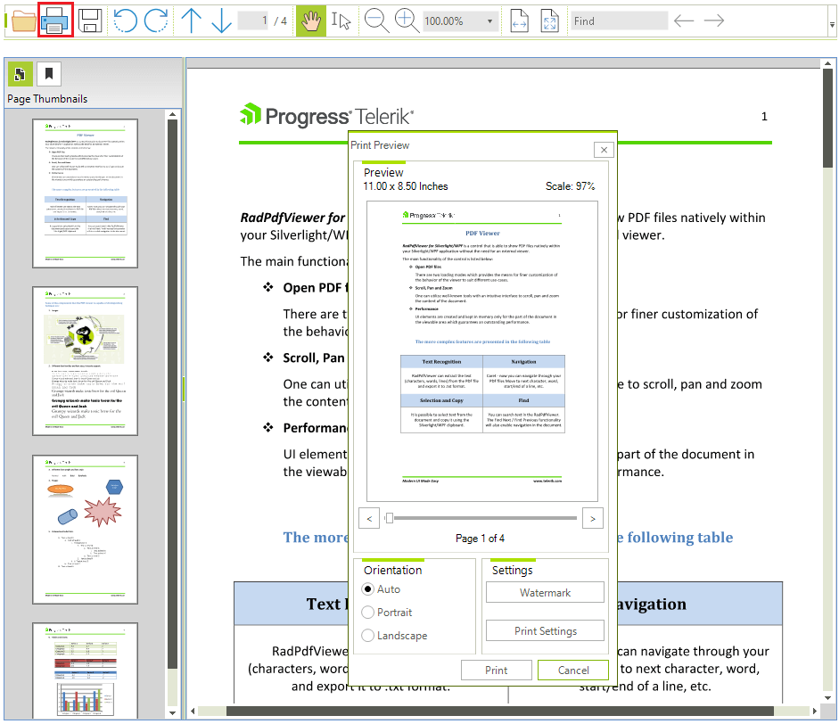

# Printing Support

RadPdfViewer can be used with [RadPrintDocument]() just as any other control that supports printing – drag a __RadPrintDocument__ to the form and set the __Printed Object__ to the desired viewer.

>caption Figure 1: Design Time


As such, __RadPdfViewer__ allows you to benefit from the features that __RadPrintDocument__ provides: header, footer, watermark, preview and settings dialogs.

## Using UI

__RadPdfViewerNavigator__ allows you to print the currently shown PDF document with a simple button click which opens the *Print Preview* dialog.

>caption Figure 2: Using RadPdfViewerNavigator 



>note As of R2 2021 RadPdfViewer offers the **UseBufferedPrinting** property. If it is set to **true**, the page will be printed in an image that will be send to the printer at once. Loss of quality is possible.

## Printing With Code

__RadPdfViewer__ also exposes the two known methods which allow you to easily print the document without involving any complicated settings:

#### Printing

{{source=..\SamplesCS\PdfViewer\PdfGettingStarted.cs region=PrintMethods}} 
{{source=..\SamplesVB\PdfViewer\PdfGettingStarted.vb region=PrintMethods}} 

````C#
this.radPdfViewer1.Print();
this.radPdfViewer1.PrintPreview();

````
````VB.NET
Me.RadPdfViewer1.Print()
Me.RadPdfViewer1.PrintPreview()

````

{{endregion}}

# See Also

* [Getting Started]()
* [Logical Structure]()
* [Visual Structure]()
* [Properties, Methods and Events]()
