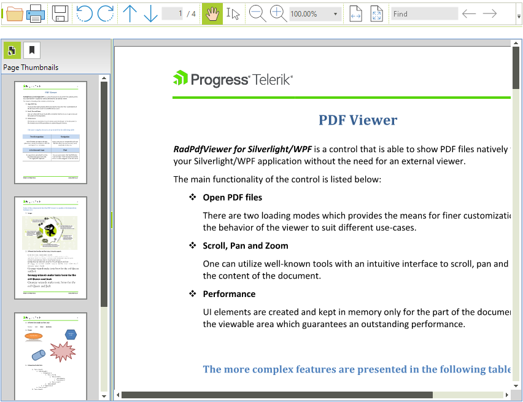

# Thumbnails

__RadPdfViewer__ providers options to display the pdf pages as thumbnails for easier navigation.

>caption Figure 1 Thumbnails

You can control whether the thumbnail element is visible by setting the __EnableThumbnail__ property.

#### Enable Thumbnails

<snippet id='pdfviewer-pdfpublicapi-enablethumbnails-cs' />
<snippet id='pdfviewer-pdfpublicapi-enablethumbnails-vb' />

## Thumbnails API

You can show or hide the thumbnails programmatically with following methods ShowThumbnails, HideThumbnails:

#### Show/Hide Thumbnails

<snippet id='pdfviewer-pdfpublicapi-showhidethumbnails-cs' />
<snippet id='pdfviewer-pdfpublicapi-showhidethumbnails-vb' />

You can customize the size of the thumbnails with __ThumbnailsScaleFactor__ property. This property sets the size of the thumbnails between 0 and 1 where 1 is the page in full size. By default this property is set to 0.15 which means 15% of the normal page size.

#### ThumbnailsScaleFactor

<snippet id='pdfviewer-pdfpublicapi-thumbnailsscalefactor-cs' />
<snippet id='pdfviewer-pdfpublicapi-thumbnailsscalefactor-vb' />

You can customize the width of the thumbnails list with the __ThumbnailListWidth__ property. Default value of this property is 200.

#### ThumbnailListWidth

<snippet id='pdfviewer-pdfpublicapi-thumbnaillistwidth-cs' />
<snippet id='pdfviewer-pdfpublicapi-thumbnaillistwidth-vb' />

# See Also

* [Getting Started]()
* [Logical Structure]()
* [Visual Structure]()
* [Properties, Methods and Events]()
