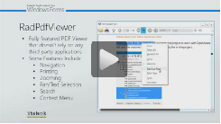
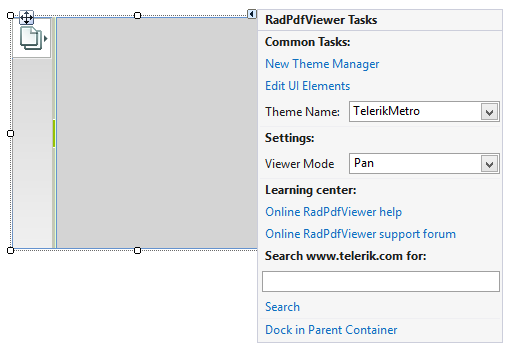
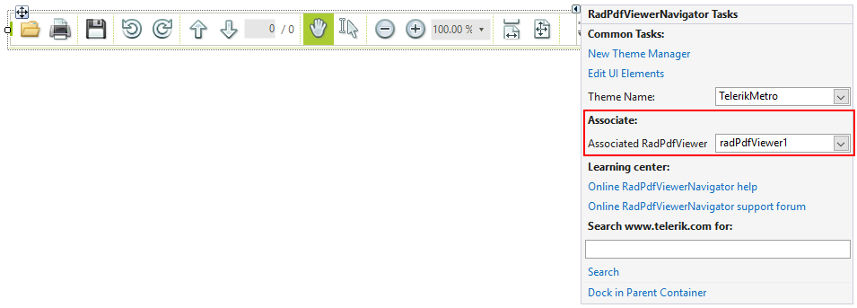

# Getting Started with WinForms PdfViewer

This tutorial will help you to quickly get started using the control.

| RELATED VIDEOS |  |
| ------ | ------ |
|[Getting Started with the WinForms RadPdfViewer](http://tv.telerik.com/watch/radcontrols-for-winforms/getting-started-with-the-winforms-radpdfviewer) __RadPdfViewer__ enables you to easily load and display PDF documents natively in your app without using any third-party tools except Telerik’s WinForms toolbox. Thanks to its built-in UI virtualization, RadPdfViewer delivers a performant solution in every scenario. This component will come as a nice addition to your Content Management Systems and Reporting applications, let’s see what __RadPdfViewer__ provides as a feature set.||

## Adding Telerik Assemblies Using NuGet

To use `RadPdfViewer` when working with NuGet packages, install the `Telerik.UI.for.WinForms.AllControls` package. The [package target framework version may vary]().

If you don’t need all controls, you can instead install a more lightweight package targeting only RadPdfViewer: **UI.for.WinForms.PdfViewer**. This package has a dependency on **UI.for.WinForms.Common**, **Telerik.Windows.Documents.Core**, and **Telerik.Windows.Documents.Fixed**, that will be automatically installed when adding the **PdfViewer NuGet**.

Read more about NuGet installation in the [Install using NuGet Packages]() article.

>tip With the 2025 Q1 release, the Telerik UI for WinForms has a new licensing mechanism. You can learn more about it [here]().

## Adding Assembly References Manually

When dragging and dropping a control from the Visual Studio (VS) Toolbox onto the Form Designer, VS automatically adds the necessary assemblies. However, if you're adding the control programmatically, you'll need to manually reference the following assemblies:

* __Telerik.Licensing.Runtime__
* __Telerik.WinControls__
* __Telerik.WinControls.PdfViewer__
* __Telerik.WinControls.UI__
* __Telerik.Windows.Documents.Core__
* __Telerik.Windows.Documents.Fixed__
* __TelerikCommon__

The Telerik UI for WinForms assemblies can be install by using one of the available [installation approaches](). 

## Defining the RadPdfViewer

This article will help you quickly get started with __RadPdfViewer__. To start off, drag and drop __RadPdfViewer__ the control from the toolbox to your form. 

> As of R1 2021 __RadPdfViewer__ is optimized to utilize the [RadPdfProcessing](https://docs.telerik.com/devtools/document-processing/libraries/radpdfprocessing/overview) library model. The idea is to unify the underlying architecture of __RadPdfViewer__ and __Telerik PdfProcessing Library__ to allow feature parity.

Once you have __RadPdfViewer__, you can set the __ViewerMode__ option to a desired value.

>caption Figure 1: Visual Studio Designer

There is also a property for the above setting which you can set in your code:

#### ViewerMode Property

<snippet id='pdfviewer-pdfgettingstarted-modes-cs' />
<snippet id='pdfviewer-pdfgettingstarted-modes-vb' />

Loading a PDF document is done via the __LoadDocument__ method. It accepts either a filename or an input stream as an argument.

#### LoadDocument Method

<snippet id='pdfviewer-pdfgettingstarted-loading-cs' />
<snippet id='pdfviewer-pdfgettingstarted-loading-vb' />

The calls above will start to load the specified document asynchronously. When the loading finishes, the __DocumentLoaded__ event will fire:

#### DocumentLoaded Event

<snippet id='pdfviewer-pdfgettingstarted-documentloaded-cs' />
<snippet id='pdfviewer-pdfgettingstarted-documentloaded-vb' />

Respectively, to unload a document, you can use the __UnloadDocument__ method 

#### UnloadDocument Method 

<snippet id='pdfviewer-pdfgettingstarted-unloading-cs' />
<snippet id='pdfviewer-pdfgettingstarted-unloading-vb' />

To provide to the end-user an additional set of abilities for manipulating the document, you can use __RadPdfViewerNavigator__. To do this, drag it from the toolbox to your form and set its __AssociatedViewer__ from its __SmartTag__ menu. 

>caption Figure 2. RadPdfViewerNavigator

You can also set this in your code by using the __AssociatedPdfViewer__ property of the __PdfViewerNavigator__.

<snippet id='pdfviewer-pdfgettingstarted-navigator-cs' />
<snippet id='pdfviewer-pdfgettingstarted-navigator-vb' />

## Assembly References

If you add the __RadPdfViewer__ at run time you need to add references to the following assemblies:

* Telerik.WinControls.PdfViewer

* Telerik.WinControls

* Telerik.WinControls.UI

* TelerikCommon

* Telerik.Windows.Documents.Fixed

* Telerik.Windows.Documents.Core

* Telerik.Windows.Zip.dll

## See Also

* [Logical Structure]()
* [Visual Structure]()
