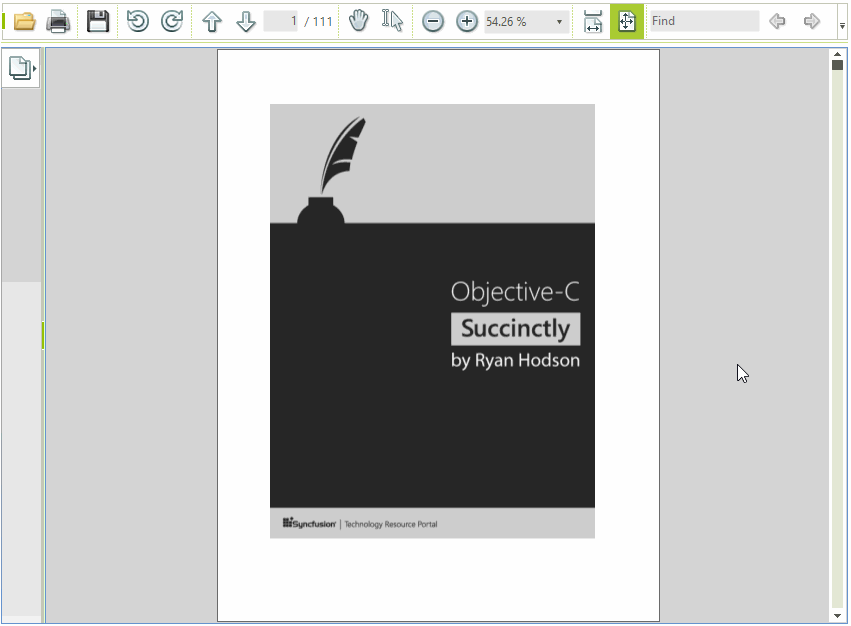

# Handle Page Rendering Events

**RadPdfViewer** exposes two events indicating when a page starts and completes a rendering operations. The article will demonstrate how these events can be utilized to display a waiting-bar during the time-consuming job.

>important The **PageRenderStarted** and **PageRenderCompleted** events are raised from a background thread so one should use [BeginInvoke](https://msdn.microsoft.com/en-us/library/a06c0dc2(v=vs.110).aspx) when interacting with any controls on the UI thread from the event handlers.  

>caption Figure 1: Waiting Bar While Rendering

#### Initial Setup and Events Subscription.

<snippet id='pdfviewer-waitingbarform-initialsetup-cs' />
<snippet id='pdfviewer-waitingbarform-initialsetup-vb' />

#### Events Handling

<snippet id='pdfviewer-waitingbarform-eventshandling-cs' />
<snippet id='pdfviewer-waitingbarform-eventshandling-vb' />

# See Also

* [Properties Methods and Events]()
* [Waiting Bar]()
