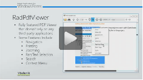
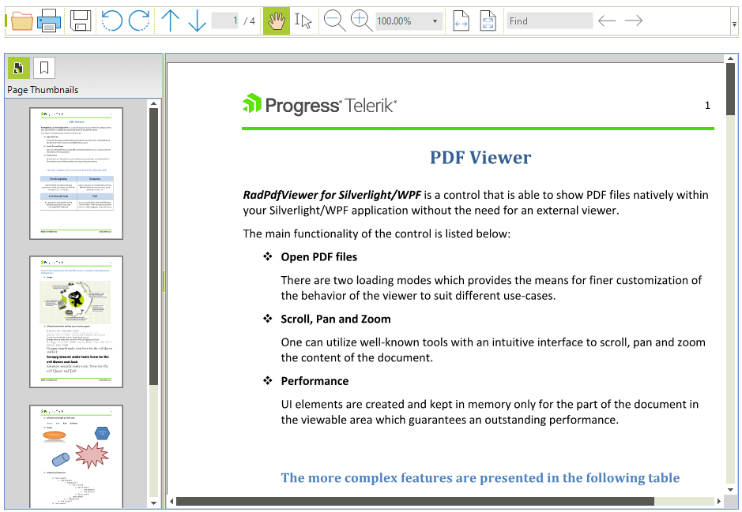

# PdfViewer

| RELATED VIDEOS |  |
| ------ | --- |
|[Getting Started with the WinForms RadPdfViewer](http://tv.telerik.com/watch/radcontrols-for-winforms/getting-started-with-the-winforms-radpdfviewer) __RadPdfViewer__ enables you to easily load and display PDF documents natively in your application without using any third-party tools except Telerik’s WinForms toolbox. Thanks to its built-in UI virtualization, RadPdfViewer delivers a efficient solution in every scenario. This component will come as a nice addition to your Content Management Systems and Reporting applications, let’s see what RadPdfViewer provides as a feature set.||

__RadPdfViewer__ is a control that can natively visualize PDF documents straight in your application. It comes with a predefined UI that is intuitive and provides the means for utilizing the features of the control. The control utilizes virtualization and supports load on-demand mode in order to guarantee good performance with larger documents. 

>caption Figure 1: RadPdfViewer

Here is a list of the supported features
* [Interactive Forms](): The control supports different types of interactive forms and enables the end user to modify their values.
* [Digital Signatures](): The user can show digitally signed documents and validate the signatures inside. Signing a document is supported as well.
* [Saving a Document](): When the user modifies the forms in a document or signs it, or just want to create another file from the document, they can use the Save As functionality of the viewer.
* [Annotations](): Full support for Widget and Link annotations. RadPdfViewer provides a read-only support for all other types of annotations.
* Fonts: Built-in support for TrueType, Type1 and CID fonts.
* [Create an Image from a PDF Page](): An API for exporting a PDF document page to an image.
* Working with [positions]() and modifying the [selection]() in the document.
* The control comes with a predefined UI that is intuitive and provides the means for utilizing the features of the control. Different dialogs are available as well.
* Using the UI you can easily zoom in and out.
* Scroll the document in the viewer.
* You can also use pan and text selection by specifying a different [viewer mode]().
* The control utilizes virtualization in order to guarantee good performance with larger documents as well.
* RadPdfViewer allows [printing]() of the document loaded in it.
* You can [rotate]() the document as well.
* [Context Menu]() to provide easy access to several of the features of the control.
* Extensible support for different stream compression filters. [Read more]()
* Support for documents encrypted with Encryption Algorithm 4 (RC4/AES-128).
* The API provides different options for extending and customizing the control.

>note **RadPdfViewer** requires **.NET Framework 4.0** and cannot be used with an older version. 

# See Also

* [Logical Structure]()
* [Visual Structure]()
* [Design Time]()
* [Getting Started]()