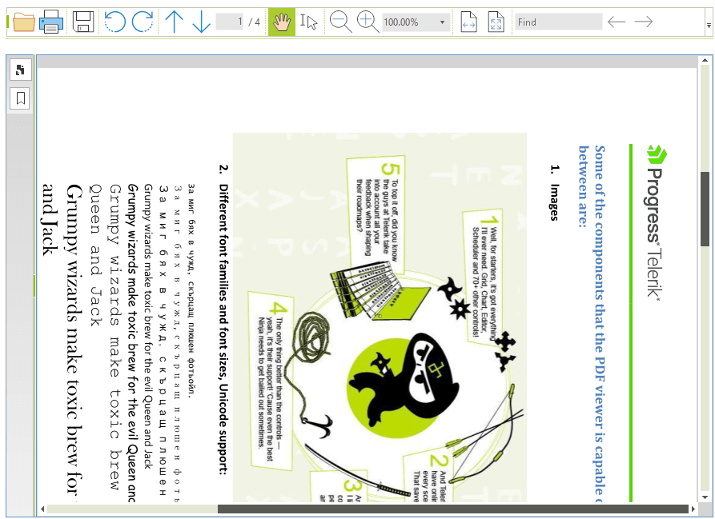

# Rotation

__RadPdfViewer__ control provides functionality for rotating the pages of the loaded document. You can programmatically rotate the document pages through the __Rotate__ method or the __RotationAngle__ property.   

        

The __Rotate__ method is intended to rotate the pages of the loaded document at the specified angle relative to its initial position. The method takes a single argument of type __RotationAngle__. The __RotationAngle__ is an enumeration that specifies the angle at which the document should be rotated. The possible values are: *Degrees0, Degrees90, Degrees180, Degrees270*.

#### Using the Rotate method:

{{source=..\SamplesCS\PdfViewer\RotationAndExport.cs region=RotateMethod}} 
{{source=..\SamplesVB\PdfViewer\RotationAndExport.vb region=RotateMethod}}
````C#
radPdfViewer1.Rotate(RotationAngle.Degrees180);

````
````VB.NET
radPdfViewer1.Rotate(RotationAngle.Degrees180)

```` 


{{endregion}}

You can use the __RotationAngle__ property to rotate the pages or get the current rotation angle.

#### Using RotationAngle property

{{source=..\SamplesCS\PdfViewer\RotationAndExport.cs region=RotationAngleProperty}} 
{{source=..\SamplesVB\PdfViewer\RotationAndExport.vb region=RotationAngleProperty}}
````C#
radPdfViewer1.RotationAngle = RotationAngle.Degrees270;

````
````VB.NET
radPdfViewer1.RotationAngle = RotationAngle.Degrees270

```` 


{{endregion}}