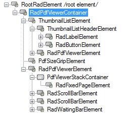
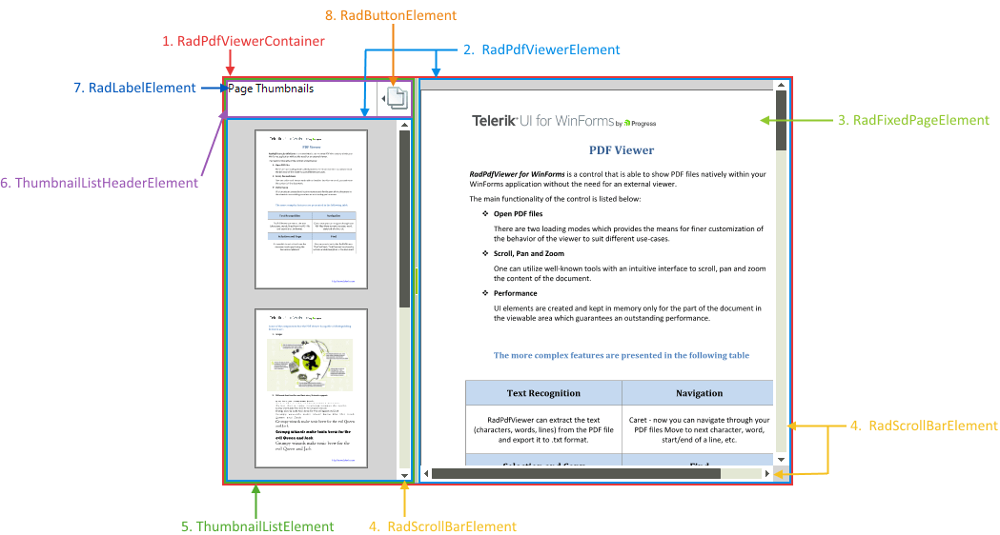

# Visual Structure

This article describes the visual structure of __RadPdfViewer__.

## Element structure

__RadPdfViewer__ has the following element structure:

>caption Figure 1: RadPdfViewer`s Element Hierarchy

>caption Figure 2: RadPdfViewer`s Structure

1. __RadPdfViewerContainer__: Container element.

1. __RadPdfViewerElement__: Main UI element responsible for dispaying the pages.

1. __RadFixedPageElement__: Represents an element which displays a single PDF page.

1. __RadScrollBarElement__: Elements representing the horizontal or vertical scroll which allows you to pan and scroll the document.

1. __ThumbnailListElement__: Main UI element holding the page thumbnails.

1. __ThumbnailListHeaderElement__: Header element.

1. __RadLabelElement__: Displays a title.

1. __RadButtonElement__: Button element responsible for showing or hiding the thumbnails.

* __PdfViewerStackContainer__: Represents a virtualized container for __RadFixedPageElements__.

* __RadWaitingBarElement__: Waiting indicator which is only visible while loading a document.

# See Also

* [Logical Structure]()
* [Design Time]()
* [Getting Started]()