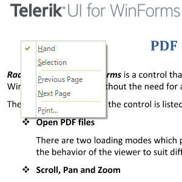
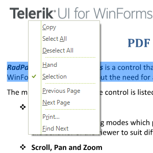

# Context Menu 

__RadPdfViewer__ has a default context menu - __PdfViewerContextMenu__ which provides a quick way of performing a number of commands. However, you can replace this menu with a custom one by setting the __RadContextMenu__ property of the __RadPdfViewer__.

#### New Context Menu

<snippet id='pdfviewer-pdfpublicapi-changecontextmenu-cs' />
<snippet id='pdfviewer-pdfpublicapi-changecontextmenu-vb' />

You can also use the __ShowMenu__ method to show the context menu programmatically at a specified location.

#### Show Context Menu

<snippet id='pdfviewer-pdfpublicapi-showcontextmenu-cs' />
<snippet id='pdfviewer-pdfpublicapi-showcontextmenu-vb' />

The context menu can change dynamically. For example, when the Text Selection mode is enabled, *Copy* and *Select All* items are displayed in the menu with a separator below them:

|FixedDocumentViewerMode.Pan|FixedDocumentViewerMode.TextSelection|
|----|----|
|||
 
Additionally, you can easily add a custom menu item to the context menu. You can find below a sample code snippet:

#### Add New Menu Item

<snippet id='pdfviewer-pdfui-customcontextmenuitem-cs' />
<snippet id='pdfviewer-pdfui-customcontextmenuitem-vb' />

# See Also

* [Getting Started]()
* [Document Modes]()
* [View Modes]()
