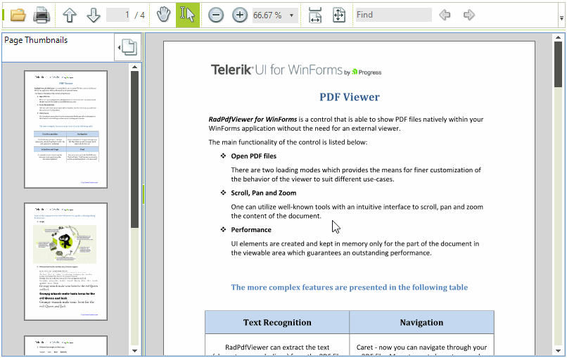

# Viewer Modes

There are three __FixedDocumentViewerModes__ which specify the behavior of __RadPdfViewer__ when you left-click in the document and move the mouse around (without releasing the left button of the mouse):

* *None*: The control does nothing;

* *Pan*: The document is scrolled in the respective direction;

>caption Figure 1: Pan


* *TextSelection* – selection is initiated, which stops when you release the button of the mouse;

>caption Figure 2: TextSelection



## Specify the Viewer Mode Using UI

The viewer mode can be changed using the __RadPdfViewerNavigator__ (as shown in the picture).
>caption Figure 3: Using the UI


## Specify the  Viewer Mode in Code

The mode of the viewer is set using the __ViewerMode__ property:

#### With Code

{{source=..\SamplesCS\PdfViewer\PdfUI.cs region=ViewerMode}} 
{{source=..\SamplesVB\PdfViewer\PdfUI.vb region=ViewerMode}} 

````C#
this.radPdfViewer1.ViewerMode = FixedDocumentViewerMode.TextSelection;

````
````VB.NET
Me.RadPdfViewer1.ViewerMode = FixedDocumentViewerMode.TextSelection

````

{{endregion}}

# See Also

* [Getting Started]()
* [Document Modes]()
* [View Modes]()
