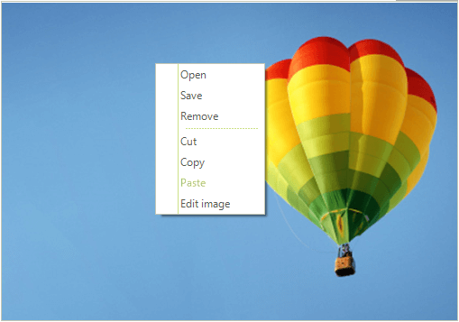
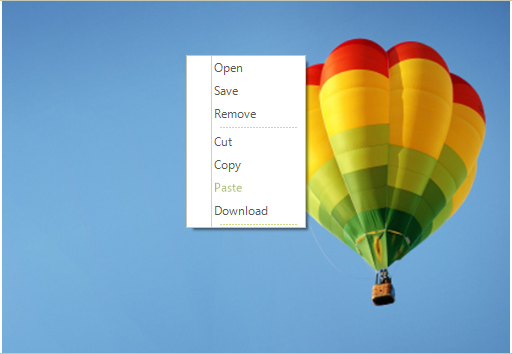

# Context Menu

The context menu will appear every time the user right-clicks on the **RadPictureBox** control. 



The context menu is enabled by default. If you want to disable it you can use the **ContextMenuEnabled** property:

#### Disable context menu
{{source=..\SamplesCS\PictureBox\PictureBoxGettingStarted.cs region=DisableContextMenu}} 
{{source=..\SamplesVB\PictureBox\PictureBoxGettingStarted.vb region=DisableContextMenu}} 

````C#
this.radPictureBox1.ContextMenuEnabled = false;

````
````VB.NET
Me.RadPictureBox1.ContextMenuEnabled = False

````

{{endregion}}

**RadPictureBox** exposes **ContextMenuProperties** that defines the properties related to the context menu. Through it you can easily access the default context menu items:
- OpenItem
- SaveItem
- RemoveItem
- CutItem
- CopyItem
- PasteItem
- EditItem


## Modifying the context menu

The default context menu in **RadPictureBox** can be customized in the **ContextMenuOpening** event handler. This event fires when the context menu is about to be opened.

### Removing an item from the context menu

In order to remove an item you can use the Items.**Remove** method and pass the desired item as a parameter in the **ContextMenuOpening** event:

{{source=..\SamplesCS\PictureBox\PictureBoxGettingStarted.cs region=RemoveItem}} 
{{source=..\SamplesVB\PictureBox\PictureBoxGettingStarted.vb region=RemoveItem}} 

````C#
private void RadPictureBox1_ContextMenuOpening(object sender, CancelEventArgs e)
{
    this.radPictureBox1.ContextMenuDropDown.Items.Remove(this.radPictureBox1.ContextMenuProperties.EditItem);
}

````
````VB.NET
Private Sub RadPictureBox1_ContextMenuOpening(ByVal sender As Object, ByVal e As CancelEventArgs)
    Me.RadPictureBox1.ContextMenuDropDown.Items.Remove(Me.RadPictureBox1.ContextMenuProperties.EditItem)
End Sub

````

{{endregion}}

### Adding new item to the context menu

In order to add a new item to the context menu you should create new menu item instance and add it to the Items collection:

{{source=..\SamplesCS\PictureBox\PictureBoxGettingStarted.cs region=AddItem}} 
{{source=..\SamplesVB\PictureBox\PictureBoxGettingStarted.vb region=AddItem}} 

````C#
RadMenuItem customMenuItem = new RadMenuItem();
private void RadPictureBox1_ContextMenuOpening1(object sender, CancelEventArgs e)
{
    customMenuItem.Text = "Download";
    RadMenuSeparatorItem separator = new RadMenuSeparatorItem();
    if (!this.radPictureBox1.ContextMenuDropDown.Items.Contains(customMenuItem))
    {
        this.radPictureBox1.ContextMenuDropDown.Items.Add(customMenuItem);
        this.radPictureBox1.ContextMenuDropDown.Items.Add(separator);
    }
}

````
````VB.NET
Private customMenuItem As RadMenuItem = New RadMenuItem()
Private Sub RadPictureBox1_ContextMenuOpening1(ByVal sender As Object, ByVal e As CancelEventArgs)
    customMenuItem.Text = "Download"
    Dim separator As RadMenuSeparatorItem = New RadMenuSeparatorItem()

    If Not Me.RadPictureBox1.ContextMenuDropDown.Items.Contains(customMenuItem) Then
        Me.RadPictureBox1.ContextMenuDropDown.Items.Add(customMenuItem)
        Me.RadPictureBox1.ContextMenuDropDown.Items.Add(separator)
    End If
End Sub

````

{{endregion}}

>note You can subscribe to the **RadMenuItem.Click** event of the newly added item and execute the desired action when the item is clicked.

The result of adding and removing items from this article is shown on the screenshot below:



### Using the ContextMenuItemClick event

**ContextMenuItemClick** event occurs when an item in the context menu is clicked. Through **RadPictureBox.ContextMenuProperties** you can easily get the clicked item. The event arguments provide **Handled** property which defines whether the menu item is processed by a custom logic or by the default implementation. For example, if you want to process a custom logic for the **EditItem** just set **e.Handled** to *true* and customize its behavior:

````C#
private void RadPictureBox1_ContextMenuItemClick(object sender, HandledEventArgs e)
{
    if (sender == this.radPictureBox1.ContextMenuProperties.EditItem)
    {
        e.Handled = true;
        // TO DO

    }
}

````
````VB.NET
Private Sub RadPictureBox1_ContextMenuItemClick(ByVal sender As Object, ByVal e As HandledEventArgs)
    If sender = Me.radPictureBox1.ContextMenuProperties.EditItem Then
        e.Handled = True
        ' ТО DO

    End If
End Sub

````

{{endregion}}


## Context menu events

**RadPictureBox** exposes the following useful events:

- **ContextMenuOpened**: Occurs when the context menu is opened.
- **ContextMenuItemClick**: Occurs when an item in the context menu is clicked.
- **ContextMenuClosing**: Occurs when the context menu is closing. Can be cancelled.
- **ContextMenuClosed**: Occurs when the context menu is closed.

# See Also

* [Edit]()
* [Pan and Zoom]()

