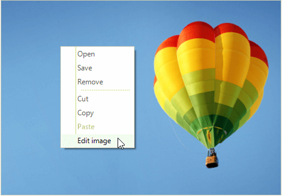
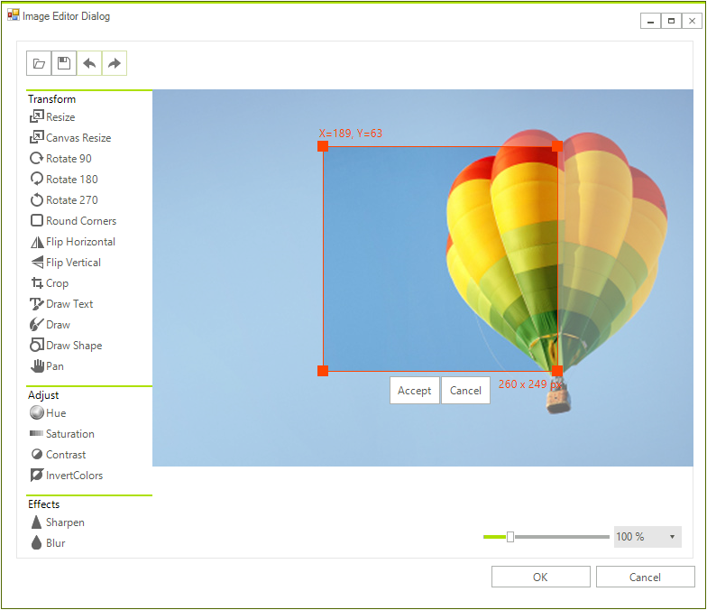
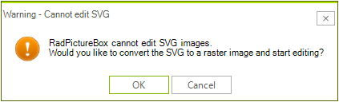

# Edit

**RadPictureBox** allows editing images. In order to edit an image it is neccessary to right click with the mouse on the control and a context menu will be shown. Then, choose the *Edit image* option.



A new window showing **PictureBoxImageEditorDialog** should be displayed. Now, you can start editing the image.

>note **PictureBoxImageEditorDialog** internally uses [RadImageEditor](https://docs.telerik.com/devtools/winforms/controls/image-editor/overview).



> RadPictureBox can not edit SVG images. Only raster images can be edited. 

If you are trying to edit SVG image you will get the following warning message:


**RadPictureBox** exposes the following useful events:

- **ImageEdited**:  Occurs when the image has been edited and the user has accepted the changes. Can be handled. Note that this event will be fired always when the user clicks the OK button of the dialog, even if there are no changes in the image.

- **ImageEditorOpening**: Occurs when the image is about to be edited in the Image Editor Dialog. Can be cancelled.

## Customize PictureBoxImageEditorDialog 

**PictureBoxImageEditorDialog** can be customized by accessing the **RadImageEditor**. You can access the **RadImageEditor** through **RadPictureBox.ImageEditorDialog.ImageEditor** property. 

>note More information about DialogFactory is available [here](https://docs.telerik.com/devtools/winforms/controls/image-editor/dialog-factory).

Below is demonstrated how to customize the ResizeDialog and set the checked state of the Preserve Aspect Ratio checkbox which by default is unchecked.

{{source=..\SamplesCS\PictureBox\PictureBoxGettingStarted.cs region=CustomizeDialog}} 
{{source=..\SamplesVB\PictureBox\PictureBoxGettingStarted.vb region=CustomizeDialog}} 

````C#
public class CustomImageEditorDialogFactory : ImageEditorDialogFactory
{
    public override ImageEditorBaseDialog CreateDialog(Type type, RadImageEditorElement imageEditorElement)
    {
        ImageEditorBaseDialog dialog = base.CreateDialog(type, imageEditorElement);
        if (dialog is ResizeDialog)
        {
            ((RadCheckBox)dialog.Controls[0].Controls["radCheckBoxAspectRation"]).Checked = true;

        }
        return dialog;
    }
}

````
````VB.NET
Public Class CustomImageEditorDialogFactory
    Inherits ImageEditorDialogFactory
    Public Overrides Function CreateDialog(ByVal type As Type, ByVal imageEditorElement As RadImageEditorElement) As ImageEditorBaseDialog
        Dim dialog As ImageEditorBaseDialog = MyBase.CreateDialog(type, imageEditorElement)

        If TypeOf dialog Is ResizeDialog Then
            CType(dialog.Controls(0).Controls("radCheckBoxAspectRation"), RadCheckBox).Checked = True
        End If
        Return dialog
    End Function
End Class

````

{{endregion}}

Finally, you need to apply this custom factory to your **PictureBoxImageEditorDialog**:

{{source=..\SamplesCS\PictureBox\PictureBoxGettingStarted.cs region=ApplyCustomFactory}} 
{{source=..\SamplesVB\PictureBox\PictureBoxGettingStarted.vb region=ApplyCustomFactory}} 

````C#
this.radPictureBox1.ImageEditorDialog.ImageEditor.ImageEditorElement.DialogFactory = new CustomImageEditorDialogFactory();

````
````VB.NET
Me.RadPictureBox1.ImageEditorDialog.ImageEditor.ImageEditorElement.DialogFactory = New CustomImageEditorDialogFactory()

````

{{endregion}}

# See Also

* [Customizing appearance]()
* [Pan and Zoom]()
* [Context Menu]()

