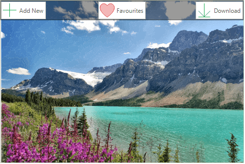

# Working With Panels

**RadPictureBox** offers a set of predefind panels *TopPanel*, *BottomPanel*, *LeftPanel*, and *RightPanel* that allows adding different elements to its item's collections in order to achieve a better user experience. 

> **TopPanel** and **BottomPanel** have RightItems, CenterItems, and LeftItems collections.         
**LeftPanel** and **RightPanel** have TopItems, BottomItems, and CenterItems collectios.
>

#### Adding Buttons to Panels

<snippet id='picturebox-pictureboxgettingstarted-panels-cs' />
<snippet id='picturebox-pictureboxgettingstarted-panels-vb' />

### Panel Display Mode

**PictureBoxPanelDisplayMode** enumeration defines three ways of displaying the panels: 
- *Always*: The panels will be displayed always.
- *OnMouseHover*: The panels will be displayed only when the mouse is over the picture box. When the mouse moves out of the control the panels will auto hide.
- *None*: The panels will not be displayed. Suitable to manually manage when the panels will be displayed.

The display mode can be changed through **PanelDisplayMode** property.

#### Setting PanelDisplayMode to be always visible

<snippet id='picturebox-pictureboxgettingstarted-paneldisplaymode-cs' />
<snippet id='picturebox-pictureboxgettingstarted-paneldisplaymode-vb' />

>note When **PanelDisplayMode** is set to *OnMouseHover*, the **AllowPanelAnimations** property indicates whether to show animations when showing and hiding panels.

### Panel Overflow Mode 

If you have horizontal as well as vertical panel displayed in **RadPictureBox** you can define which one to overflow. This can be done by setting the **PanelOverflowMode** property to **PictureBoxPanelOverflowMode**.*HorizontalOverVertical* or **PictureBoxPanelOverflowMode**.*VerticalOverHorizontal*.

#### Setting PanelOverflowMode

<snippet id='picturebox-pictureboxgettingstarted-paneloverflowmode-cs' />
<snippet id='picturebox-pictureboxgettingstarted-paneloverflowmode-vb' />

# See Also

* [Edit]()
* [Pan and Zoom]()
* [Context Menu]()

