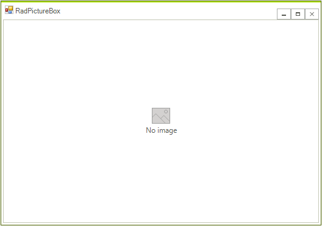
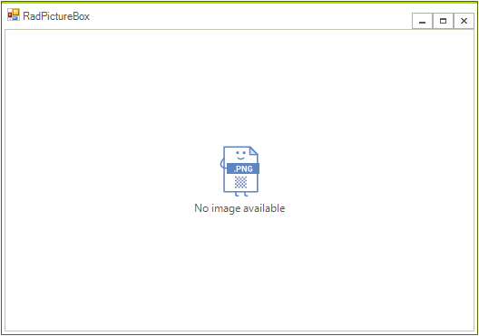

# Getting Started

To start using the control you only need to add a **RadPictureBox** control to the form either at design time by dragging it from the toolbox and dropping it into the form or via code. From the smart tag you can dock the control in parent's container.

By default, the control is shown with no image icon:



### Customize Default Look When there is No Image

You can use the **DefaultSvgImage/DefaultImage** and **DefaultText** properties to customize both the image icon and text according to your needs:

{{source=..\SamplesCS\PictureBox\PictureBoxGettingStarted.cs region=DefaultImageAndText}} 
{{source=..\SamplesVB\PictureBox\PictureBoxGettingStarted.vb region=DefaultImageAndText}} 

````C#
this.radPictureBox1.DefaultSvgImage = RadSvgImage.FromFile(@"..//..//PictureBox//noimage.svg");
this.radPictureBox1.DefaultText = "No image available";

````
````VB.NET
Me.RadPictureBox1.DefaultSvgImage = RadSvgImage.FromFile("..//..//PictureBox//noimage.svg")
Me.RadPictureBox1.DefaultText = "No image available"

````

{{endregion}}



### Load an Image

To load an image in **RadPictureBox** control you can use **SvgImage** or **Image** property:

-  **Load an image**:

{{source=..\SamplesCS\PictureBox\PictureBoxGettingStarted.cs region=LoadImage}} 
{{source=..\SamplesVB\PictureBox\PictureBoxGettingStarted.vb region=LoadImage}} 

````C#
this.radPictureBox1.Image = Image.FromFile(@"..//..//PictureBox//emoticon-happy.png");

````
````VB.NET
Me.RadPictureBox1.Image = Image.FromFile("..//..//PictureBox//emoticon-happy.png")

````

{{endregion}}

- **Load SVG image**:

{{source=..\SamplesCS\PictureBox\PictureBoxGettingStarted.cs region=LoadSvgImage}} 
{{source=..\SamplesVB\PictureBox\PictureBoxGettingStarted.vb region=LoadSvgImage}} 

````C#
this.radPictureBox1.SvgImage = RadSvgImage.FromFile(@"..//..//PictureBox//emoticon-happy.svg");

````
````VB.NET
Me.RadPictureBox1.SvgImage = RadSvgImage.FromFile("..//..//PictureBox//emoticon-happy.svg")

````

{{endregion}}


# See Also

* [Overview]()
* [Structure]()

