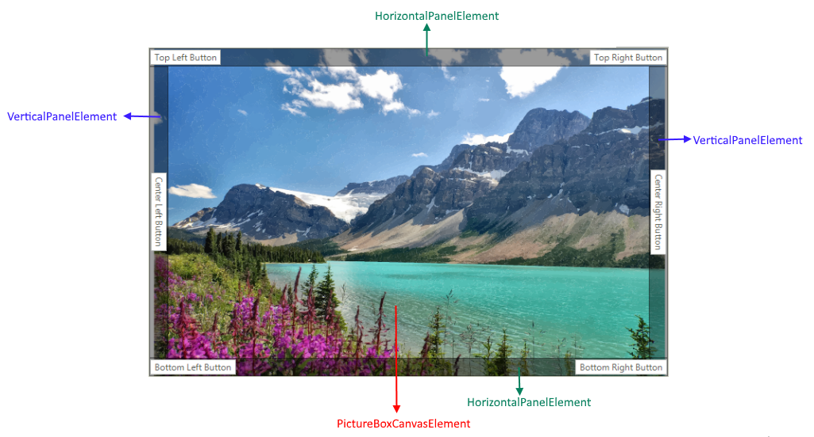
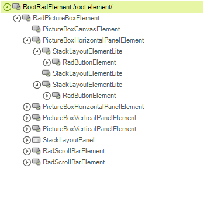

# Structure

This article describes the inner structure and organization of the elements which build the **RadPictureBox** control.

Figure 1: RadPictureBox visual structure

## Element Hierarchy

* **RadPictureBoxElement** -  Represents the main element in **RadPictureBox**.
* **PictureBoxCanvasElement** - Represents the element that is responsible for drawing the image.
* **PictureBoxHorizontalPanelElement** - Represents the top and bottom horizontal panels. This panel allows adding elements in three collections - left, center and right. Each of these three collections is represented by a **StackLayoutElementLite**.
* **PictureBoxVerticalPanelElement** - Represents the left and right vertical panels. This panel allows adding elements in three collections - top, center and bottom. Each of these three collections is represented by a **StackLayoutElementLite**.
* **StackLayoutElementLite** - Represents a stack layout element that arranges its children horizontally or vertically. Is also offers **ElementSpacing** property and respects the element's alignment.
* **Vertical ScrollBar** - Scrolls the image vertically.
* **Horizontal ScrollBar** - Scrolls the image horizontally.

Figure 2: RadPictureBox elements hierarchy

# See Also

* [Overview]()
* [Getting Started]()

