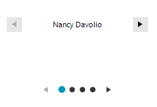

# Data Binding

## Bound mode

**RadPipsPager** provides built-in option to bind the control to any collection by using the **BindingSource** property. When in bound mode the **RadPipsPager** automatically changes the **Position** of the **BindingSource**. The number of the pips is also calculated automatically based on the used data.

The following example demonstrates a basic scenario where **RadPipsPager** is used with **RadSlideView**. Here, **RadPipsPager** is bound to a BindingList&lt;T&gt; of a custom object:

#### Bind RadPipsPager

<snippet id='pipspager-pipspagergettingstarted-bindingpipspager-cs' />
<snippet id='pipspager-pipspagergettingstarted-bindingpipspager-vb' />


#### Sample Data Object

<snippet id='pipspager-pipspagergettingstarted-sampledataobject-cs' />
<snippet id='pipspager-pipspagergettingstarted-sampledataobject-vb' />




## Unbound mode

In unbound mode, the **NumberOfPages** property determines the amount of pips items that are shown. 

<snippet id='slideview-gettingstartedgallery-pipsslider-cs' />
<snippet id='slideview-gettingstartedgallery-pipsslider-vb' />


Then, you can handle the **SelectedIndexChanged** event to get notified when the user changes the selected **PipsPagerItem**. The **SelectedPipChangedEventArgs** gives access to the new and old pip.

````C#
private void RadPipsPager1_SelectedIndexChanged(object sender, Telerik.WinControls.UI.PipsPager.SelectedPipChangedEvent
{

    this.source.Position = e.NewIndex;
}     

````
````VB.NET
Private Sub RadPipsPager1_SelectedIndexChanged(ByVal sender As Object, ByVal _ As Telerik.WinControls.UI.PipsPager.SelectedPipChangedEvent)
    Me.source.Position = e.NewIndex
End Sub

```` 


## See Also
* [Overview]() 
* [Getting Started]() 
