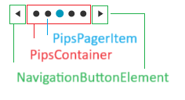
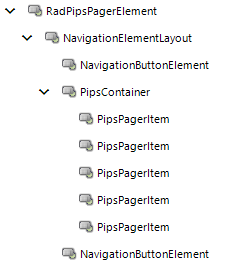

# Structure

This article describes the inner structure and organization of the elements which build __RadPipsPager__.

* __PipsContainer__: Stores a collection of __PipsPagerItems__ one of which is currently selected.

* __NavigationButtonElement__: Navigation buttons used for moving forward/backward the current item.

## Elements Hierarchy

## See Also

* [Design Time]()