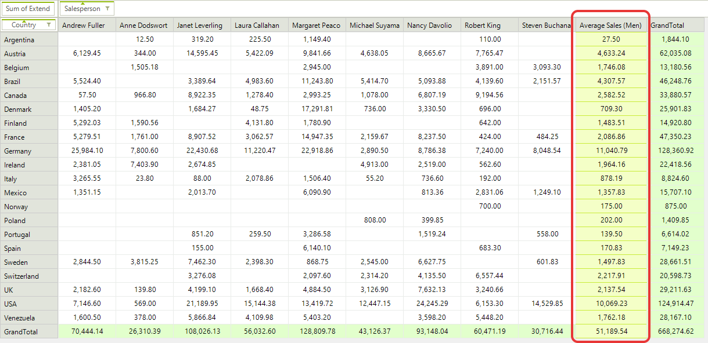
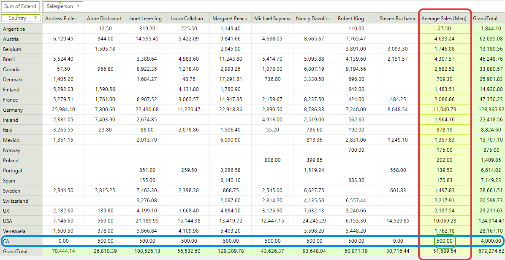
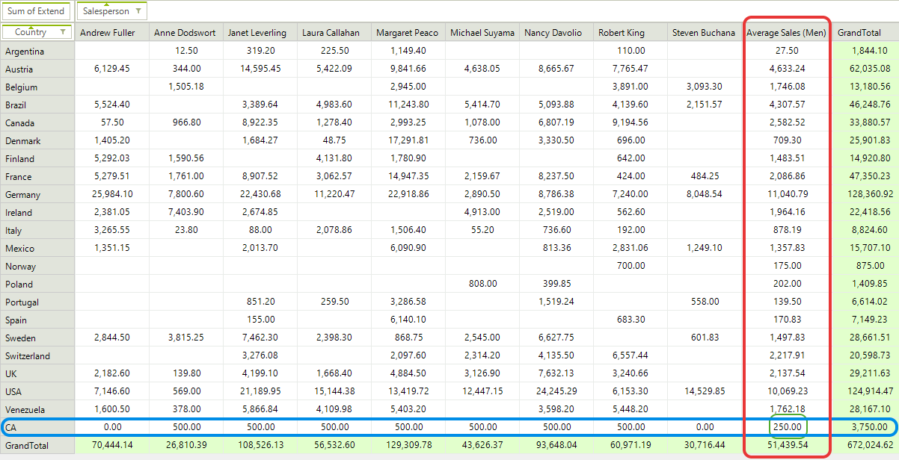

# Calculated items

A calculated item is a new item in a row or column field in which the values are the result of a custom calculation. In this case, the calculated item’s formula references one or more items in the same field. By using Calculated Items you are able to extend __RadPivotGrid__ with additional items that are not part of the data source.

## Defining Calculated Item

With __RadPivotGrid__ you are able to create different Groups that will be shown in Rows and Columns. But in some cases you may need to show additional items for specific group. In this case you may use Calculated Items. Calculated Items are added to a group description and they have access to different items from the same group. For example, lets say we want to calculate the average sales made by some of the sales people, but not all of them. First we have to create a concrete class that implements the abstract *CalculatedItem* class. For this purpose the new class must implement GetValue method. In our scenario we'll show the average sales of four of the sales people:

#### Calculated Item

<snippet id='pivotgrid-pivotgridcalculateditems-calculateditemclasses-cs' />
<snippet id='pivotgrid-pivotgridcalculateditems-calculateditemclasses-vb' />

As you can see the calculated item will show the average sales of four people. Now we just have to add it to the **PropertyGroupDescription**. In our case this will be the *Salesperson* group:

<snippet id='pivotgrid-pivotgridcalculateditems-addcalcitemwithoutsortorder-cs' />
<snippet id='pivotgrid-pivotgridcalculateditems-addcalcitemwithoutsortorder-vb' />

>caption Figure 1: RadPivotGrid Calculated Item

## Add Calculated Items at Run-time

Calculated items can be added only to Group Descriptions. If you are using __RadPivotFieldList__ the users can remove the group for which you've added calculated items and this way the calculated items will be removed as well. Adding the same group in rows or columns will not show the calculated items anymore. In order to add them again you have to use **PrepareDescriptionForField** event of **LocalDataSourceProvider** and add the calculated items to the description:

#### PrepareDescriptionForField Event

<snippet id='pivotgrid-pivotgridcalculateditems-localprovider_preparedescriptionforfield-cs' />
<snippet id='pivotgrid-pivotgridcalculateditems-localprovider_preparedescriptionforfield-vb' />

## Solve Order

If you have calculated items in both rows and columns group descriptions, you have to define which of them will be used for the intersected cells. That's why each Calculated Item has **SolveOrder** property - when a cell is an intersection between two calculated items the one with higher solve order will be used.

#### SolveOrder Property

<snippet id='pivotgrid-pivotgridcalculateditems-addcalcitemwithsortorder-cs' />
<snippet id='pivotgrid-pivotgridcalculateditems-addcalcitemwithsortorder-vb' />

Here is the result: 

>caption Figure 1: SolveOrder Example 1

As you can see the intersected cell between the two calculated items has value 500 as the CA calculated item has higher solve order. If we change the solve order of Men Average Sales to a higher value, for example 5, here is how __RadPivotGrid__ will look like:

>caption Figure 2: SolveOrder Example 2

# See Also

* [Calculated Fields]()
* [Custom Aggregation]()
