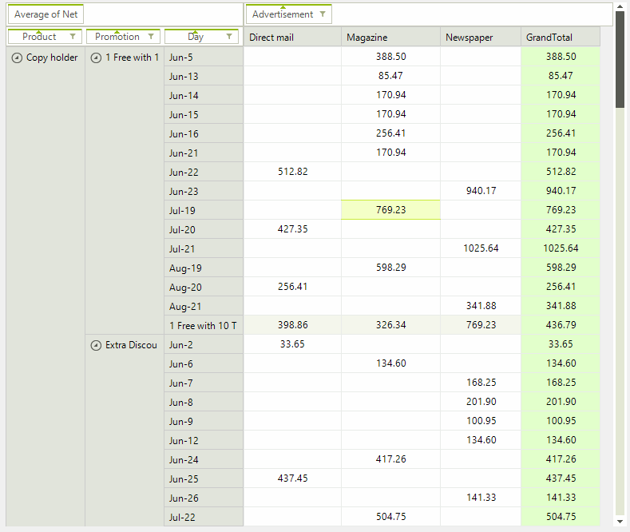

# Context Menu

The context menu used by **RadPivotGrid** can be easily extended. It is a common requirement to add new items to the menu or modify the existing ones.

The PivotGridContextMenuBase.**Context** property provides information about the element triggering the Click event. The example below will evaluate the context so that we add an additional element whenever the menu opens after click on any of the pivot data cells. 

>caption Figure 1: Custom Context Menu Item

#### Initialize and Set Custom Menu

<snippet id='pivotgrid-pivotgridconextmenuform-setcontextmenu-cs' />
<snippet id='pivotgrid-pivotgridconextmenuform-setcontextmenu-vb' />

#### Custom Context Menu Class 

<snippet id='pivotgrid-pivotgridconextmenuform-customcontextmenu-cs' />
<snippet id='pivotgrid-pivotgridconextmenuform-customcontextmenu-vb' />

# See Also

* [Spread Export]()
* [Export to PDF]()
