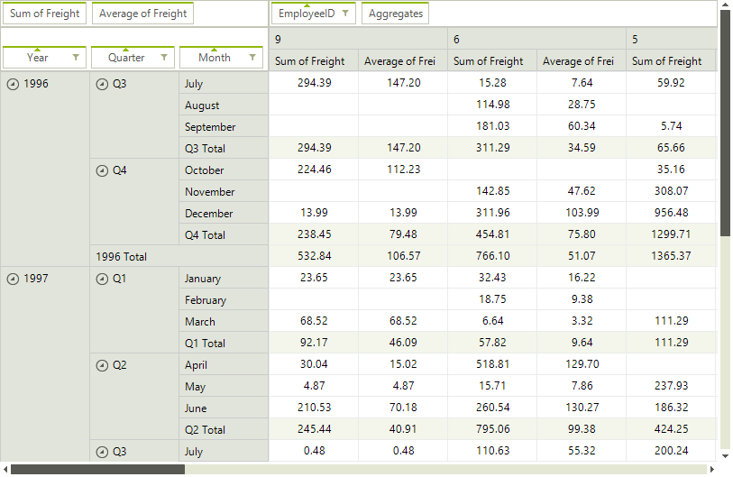
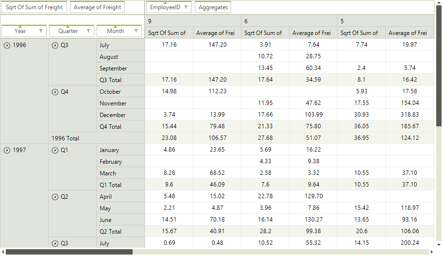

# Custom Aggregation

__RadPivotGrid__ is designed to aggregate data and it provides an API for assigning special aggregation functions performing custom calculations. For the purpose of this example we will use a __LocalDataSourceProvider__ object and we will bind the pivot control to the *Orders* table from the *Northwind* database as explained [here]().

>caption Figure 1: Using the Built-in *Sum* function
>

>caption Figure 2: Using the Custom *Sqrt Of Sum* function
>

## Defining a Custom Aggregation Function

Our new function will be almost the same as the already available __AggregateFunctions.Sum__, with the important difference that it will calculate not the sum of the items, but the sum of their square roots.

#### Custom Function Logic

{{source=..\SamplesCS\PivotGrid\SqrtSumAggregateFunction.cs region=AggregateFunction}} 
{{source=..\SamplesVB\PivotGrid\SqrtSumAggregateFunction.vb region=AggregateFunction}}
````C#
public class SqrtSumAggregateFunction : Telerik.Pivot.Core.Aggregates.AggregateFunction
{
    public override string DisplayName
    {
        get { return "Sqrt Of Sum"; }
    }
    protected override AggregateValue CreateAggregate(Type dataType)
    {
        return new SqrtSumAggregate();
    }
    public override string GetStringFormat(Type dataType, string format)
    {
        if (format == null)
        {
            return "G";
        }
        return format;
    }
    public override string ToString()
    {
        return "Sqrt Of Sum";
    }
    public override bool Equals(object obj)
    {
        return obj is SqrtSumAggregateFunction;
    }
    protected override void CloneCore(Telerik.Pivot.Core.Cloneable source)
    {
    }
    protected override Telerik.Pivot.Core.Cloneable CreateInstanceCore()
    {
        return new SqrtSumAggregateFunction();
    }
    protected override AggregateValue CreateAggregate(IAggregateContext context)
    {
        return this.CreateAggregate(context.DataType);
    }
}

````
````VB.NET
Imports System.Globalization
Imports Telerik.Pivot.Core
Imports Telerik.Pivot.Core.Aggregates
Public Class SqrtSumAggregateFunction
    Inherits Telerik.Pivot.Core.Aggregates.AggregateFunction
    Public Overrides ReadOnly Property DisplayName() As String
        Get
            Return "Sqrt Of Sum"
        End Get
    End Property
    Protected Overrides Function CreateAggregate(dataType As Type) As AggregateValue
        Return New SqrtSumAggregate()
    End Function
    Public Overrides Function GetStringFormat(dataType As Type, format As String) As String
        If format Is Nothing Then
            Return "G"
        End If
        Return format
    End Function
    Public Overrides Function ToString() As String
        Return "Sqrt Of Sum"
    End Function
    Public Overrides Function Equals(obj As Object) As Boolean
        Return TypeOf obj Is SqrtSumAggregateFunction
    End Function
    Protected Overrides Sub CloneCore(source As Telerik.Pivot.Core.Cloneable)
    End Sub
    Protected Overrides Function CreateInstanceCore() As Telerik.Pivot.Core.Cloneable
        Return New SqrtSumAggregateFunction()
    End Function
    Protected Overrides Function CreateAggregate(context As IAggregateContext) As AggregateValue
        Return Me.CreateAggregate(context.DataType)
    End Function
End Class

````


{{endregion}}

## Defining a Custom Aggregate Value

We also need to create a custom aggregate value class which will be used by our newly defined function to perform the actual calculation. 

#### Custom Aggregate Logic

{{source=..\SamplesCS\PivotGrid\SqrtSumAggregateFunction.cs region=AggregateValue}} 
{{source=..\SamplesVB\PivotGrid\SqrtSumAggregateFunction.vb region=AggregateValue}}
````C#
public sealed class SqrtSumAggregate : AggregateValue, IConvertibleAggregateValue<double>
{
    private double sum;
    private bool hasError = false;
    protected override object GetValueOverride()
    {
        return Math.Round(Math.Sqrt(this.sum), 2);
    }
    protected override void AccumulateOverride(object value)
    {
        this.sum += Convert.ToDouble(value, CultureInfo.InvariantCulture);
    }
    protected override void MergeOverride(AggregateValue childAggregate)
    {
        var sumAggregate = childAggregate as SqrtSumAggregate;
        if (sumAggregate != null)
        {
            this.sum += sumAggregate.sum;
        }
        else
        {
            double doubleValue;
            if (AggregateValueExtensions.TryConvertValue<double>(childAggregate, out doubleValue))
            {
                this.sum += doubleValue;
            }
            else
            {
                this.sum = 0;
                this.hasError = true;
            }
        }
    }
    bool IConvertibleAggregateValue<double>.TryConvertValue(out double value)
    {
        if (this.hasError)
        {
            value = 0;
            return false;
        }
        value = (double)this.sum;
        return true;
    }
}

````
````VB.NET
Public NotInheritable Class SqrtSumAggregate
    Inherits AggregateValue
    Implements IConvertibleAggregateValue(Of Double)
    Private sum As Double
    Private hasError As Boolean = False
    Protected Overrides Function GetValueOverride() As Object
        Return Math.Round(Math.Sqrt(Me.sum), 2)
    End Function
    Protected Overrides Sub AccumulateOverride(value As Object)
        Me.sum += Convert.ToDouble(value, CultureInfo.InvariantCulture)
    End Sub
    Protected Overrides Sub MergeOverride(childAggregate As AggregateValue)
        Dim sumAggregate = TryCast(childAggregate, SqrtSumAggregate)
        If sumAggregate IsNot Nothing Then
            Me.sum += sumAggregate.sum
        Else
            Dim doubleValue As Double
            If AggregateValueExtensions.TryConvertValue(Of Double)(childAggregate, doubleValue) Then
                Me.sum += doubleValue
            Else
                Me.sum = 0
                Me.hasError = True
            End If
        End If
    End Sub
    Private Function IConvertibleAggregateValue_TryConvertValue(ByRef value As Double) As Boolean Implements IConvertibleAggregateValue(Of Double).TryConvertValue
        If Me.hasError Then
            value = 0
            Return False
        End If
        value = CDbl(Me.sum)
        Return True
    End Function
End Class

````


{{endregion}}

## Assigning the Custom Function

We can make use of our new function by assigning it to the __AggregateFunction__ property of a __PropertyAggregateDescription__ object before setting it to our pivot.

>note The [Custom Dialogs]() article demonstrates how the custom function can be added to the *Aggregate Options Dialog*.

#### Using the Custom Aggregate Function

{{source=..\SamplesCS\PivotGrid\PivotGridCustomAggregation.cs region=CustomFunctionUsage}} 
{{source=..\SamplesVB\PivotGrid\PivotGridCustomAggregation.vb region=CustomFunctionUsage}}
````C#
LocalDataSourceProvider dataProvider = new LocalDataSourceProvider();
dataProvider.ItemsSource = dataset.Orders;
dataProvider.AggregateDescriptions.Add(new PropertyAggregateDescription() { PropertyName = "Freight", AggregateFunction = new SqrtSumAggregateFunction() });
this.radPivotGrid1.DataProvider = dataProvider;

````
````VB.NET
Dim dataProvider As New LocalDataSourceProvider()
dataProvider.ItemsSource = dataset.Orders
dataProvider.AggregateDescriptions.Add(New PropertyAggregateDescription() With { _
.PropertyName = "Freight", _
.AggregateFunction = New SqrtSumAggregateFunction() _
})
Me.RadPivotGrid1.DataProvider = dataProvider

```` 

{{endregion}}

* [Calculated Fields]()
* [Calculated Items]()
* [Custom Dialogs]()