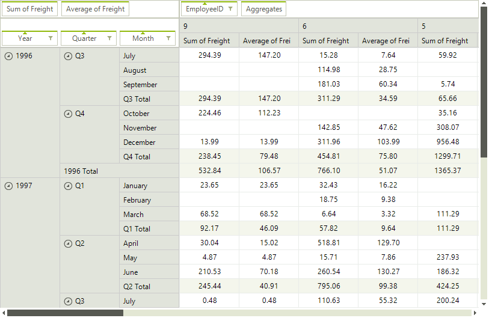
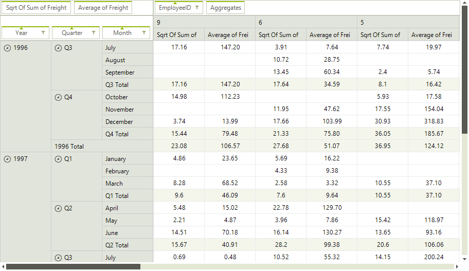
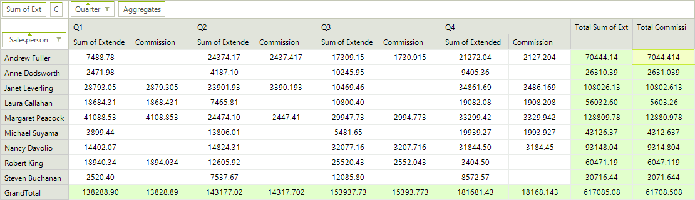

# Custom Aggregation

__RadPivotGrid__ is designed to aggregate data and it provides an API for assigning special aggregation functions performing custom calculations. For the purpose of this example we will use a __LocalDataSourceProvider__ object and we will bind the pivot control to the *Orders* table from the *Northwind* database as explained [here]().

>caption Figure 1: Using the Built-in *Sum* function

>caption Figure 2: Using the Custom *Sqrt Of Sum* function

## Defining a Custom Aggregation Function

Our new function will be almost the same as the already available __AggregateFunctions.Sum__, with the important difference that it will calculate not the sum of the items, but the sum of their square roots.

#### Custom Function Logic

<snippet id='pivotgrid-sqrtsumaggregatefunction-aggregatefunction-cs' />
<snippet id='pivotgrid-sqrtsumaggregatefunction-aggregatefunction-vb' />

## Defining a Custom Aggregate Value

We also need to create a custom aggregate value class which will be used by our newly defined function to perform the actual calculation. 

#### Custom Aggregate Logic

<snippet id='pivotgrid-sqrtsumaggregatefunction-aggregatevalue-cs' />
<snippet id='pivotgrid-sqrtsumaggregatefunction-aggregatevalue-vb' />

## Assigning the Custom Function

We can make use of our new function by assigning it to the __AggregateFunction__ property of a __PropertyAggregateDescription__ object before setting it to our pivot.

>note The [Custom Dialogs]() article demonstrates how the custom function can be added to the *Aggregate Options Dialog*.

#### Using the Custom Aggregate Function

<snippet id='pivotgrid-pivotgridcustomaggregation-customfunctionusage-cs' />
<snippet id='pivotgrid-pivotgridcustomaggregation-customfunctionusage-vb' />

>important If you add calculated fields in code behind, you have to set the __ItemsSource__ of __LocalDataSourceProvider__ after  you have added all calculated fields or to wrap the code between (including setting the __ItemsSource__ ) __BeginInit/EndInit__ methods (or inside __using DeferRefresh() { ... }__ section ).
>

>caption Figure 2: Calculated Field in RadPivotGrid

# See Also

* [Calculated Fields]()
* [Calculated Items]()
* [Custom Dialogs]()
* [How to Add Weighted Average in RadPivotGrid]()
