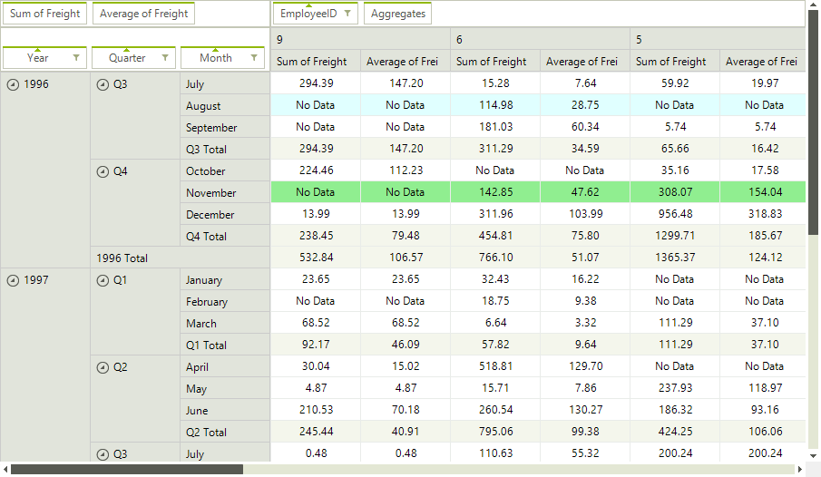
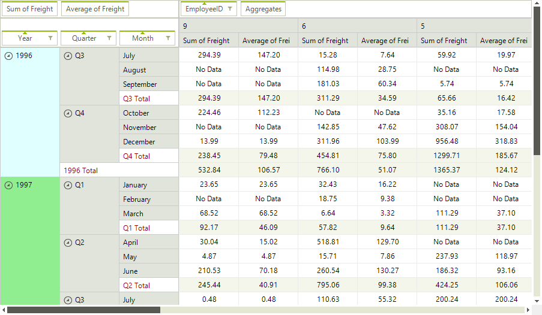

# Formatting Appearance

This article shows how you can change the appearance of specific cells.

## CellFormatting

Using the **CellFormatting** event you can also set various properties of the **PivotCellElement** to modify its appearance. The following example colors the cells in August in Blue color and those in November in Green color:

>caption Figure 1: Formatting Pivot Data Cells

#### CellFormatting Event

<snippet id='pivotgrid-pivotgridformattingappearance-cellformatting-cs' />
<snippet id='pivotgrid-pivotgridformattingappearance-cellformatting-vb' />

## GroupElementFormatting

The **GroupElementFormatting** event can be used for styling the group cells:

>caption Figure 2: Formatting Group Cells

#### GroupElementFormatting Event

<snippet id='pivotgrid-pivotgridformattingappearance-group-cs' />
<snippet id='pivotgrid-pivotgridformattingappearance-group-vb' />

##  ErrorString and EmpltyValueString

Using the __ErrorString__ and __EmpltyValueString__ properties of RadPivotGrid, you can set the strings that will appears correspondingly if an error occurs during the calculation of a cell value or if there is no data for a given cell. An error can occur for example if you try to sum a text column.

#### Error and Empty Value Strings

<snippet id='pivotgrid-pivotgridformattingappearance-setformatstrings-cs' />
<snippet id='pivotgrid-pivotgridformattingappearance-setformatstrings-vb' />

# See Also

* [Structure]()
