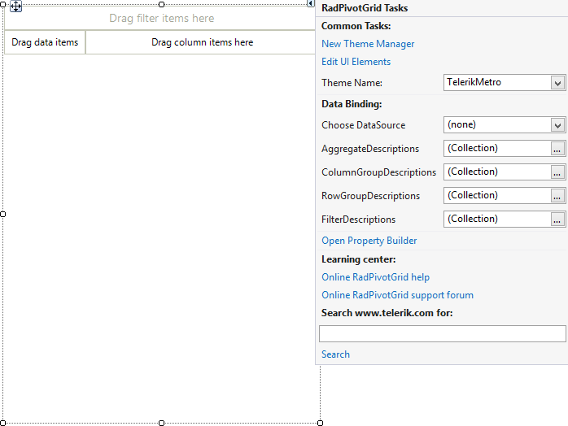

# Smart Tag

To start using **RadPivotGrid** just drag it from the toolbox and drop it at the form.

Select **RadPivotGrid** and click the small arrow on the top right position in order to open the Smart Tag.

>caption Figure 1: Smart Tag

* **Common Tasks**

	* **New Theme Manager**: Adds a new **RadThemeManager** component to the form.

	* **Edit UI elements**: Opens a dialog that displays the *Element Hierarchy Editor*. This editor lets you browse all the elements in the control.
	
	* **Theme Name**: Specifies the theme set to the control.

* **Data Binding**

	* **Choose DataSource**: Populates the pivot with the specified data source object.
	
	* **AggregateDescriptions**: Specifies the aggregates.
	
	* **ColumnGroupDescriptions**: Specifies the column groups.
	
	* **RowGroupDescriptions**: Specifies the row groups.
	
	* **FilterDescriptions**: Allows you to specify the rules for filtering.

* **Learning Center**: Navigates to the Telerik help, code library projects or support forum.

* **Search**: Searches the Telerik website for a given query.

# See Also

* [Property Builder]()
* [Structure]()
