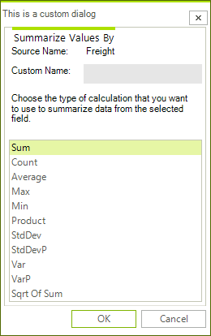

# Customizing the Dialogs

To customize the dialogs in **RadPivotGrid**/**RadPivotFieldList**, you can either inherit from them to override/extend the base functionality or you can create an entirely custom dialogs by implementing the corresponding dialog interface.

>caption Figure 1: Custom Header Text

#### Custom AggregateOptionsDialog

The functions list displayed in the dialog can be modified. It can also be extended with custom aggregate functions. The example below adds the sample *SqrtSumAggregateFunction* to the list with the default functions.

>note The [Custom Aggregation]() article discusses in details the API for creating custom functions as well as it includes the source code of the custom function used below.

<snippet id='pivotgrid-pivotgriddialogs-myaggregateoptionsdialog-cs' />
<snippet id='pivotgrid-pivotgriddialogs-myaggregateoptionsdialog-vb' />

When RadPivotGrid and **RadPivotFieldList** need a dialog, they use the __PivotGridDialogsFactory__ to create an instance of a dialog. To replace the default dialogs with your custom ones, you need to implement a custom factory as show below.

#### Custom PivotGridDialogsFactory

<snippet id='pivotgrid-pivotgriddialogs-mydialogsfactory-cs' />
<snippet id='pivotgrid-pivotgriddialogs-mydialogsfactory-vb' />

Then, you need to assign it to RadPivotGrid and RadPivotFieldList:

#### Set Custom Factory

<snippet id='pivotgrid-pivotgriddialogs-setfactories-cs' />
<snippet id='pivotgrid-pivotgriddialogs-setfactories-vb' />

# See Also

* [Dialogs Overview]()
* [Custom Aggregation]()
