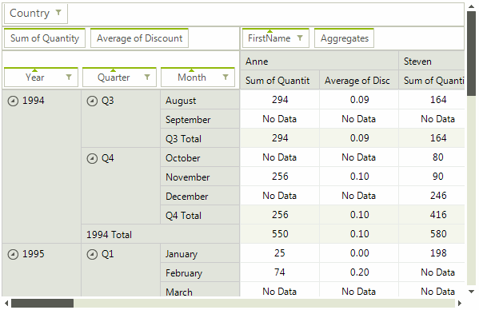

# PivotGridDragDropService

With the built-in drag and drop functionality of **RadPivotGrid**, achieved by the **PivotGridDragDropService**, the end-user can easily change the way data is aggregated. This can be done by dragging a field descriptor element to another descriptor area or changing the descriptors order within the same area. This behavior can be easily disabled by setting the **AllowFieldsDragDrop** property to *false*.

>caption Figure 1: PivotGridDragDropService

Similar to [RadDragDropService](), **PivotGridDragDropService** exposes public events which allows to handle the drag and drop operation and customize it according to your requirements, e.g. control which items to be dragged.

# See Also

* [RadDragDropService]()	
