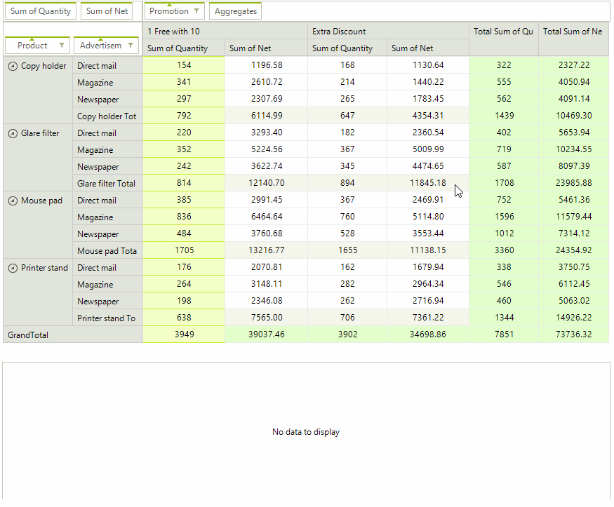

# Drill Down

The value of a particular __PivotCellElement__ is calculated depending on the applied row and column groups together with the aggregate descriptions.

The __LocalDataSourceProvider__ exposes a __GetUnderlyingData__ method which allows extracting the records from the data source object responsible for accumulating the result for a particular row and column. The __GetUnderlyingData__ method is working with two parameters: __Row Group__ and __Column Group__.

In the example below we will handle RadPivotGrid.__MouseDoubleClick__ event and use the retrieved IEnumerable object to bind [RadGridView]() and display the result.

>caption Figure 1: Drill Down Data

#### GetUnderlyingData Method

<snippet id='pivotgrid-pivotgriddrilldownform-getunderlyingdatamethod-cs' />
<snippet id='pivotgrid-pivotgriddrilldownform-getunderlyingdatamethod-vb' />

The underlying data can be retrieved by handling the __GetUnderlyingDataCompleted__ event and accessing the __DrillDownCompletedEventArgs__ arguments:

* __Result__: An IEnumerable representing the result of the underlying data extraction operation.
* __InnerExceptions__: A *read-only* collection with the thrown exceptions during the underlying data extraction.

>note If the __DeferUpdates__ property of the __LocalDataSourceProvider__ is set to *true*, calling the __GetUnderlyingData__ method without first updating the provider will result in an __InvalidOperationException__.

>important The underlying data is extracted asynchronously when using the assemblies built for .NET 4.0. In this respect it is necessary to use [BeginInvoke](https://msdn.microsoft.com/en-us/library/a06c0dc2(v=vs.110).aspx) if the retrieved data will be used on the UI thread.

#### GetUnderlyingDataCompleted Event

<snippet id='pivotgrid-pivotgriddrilldownform-getunderlyingdatacompletedevent-cs' />
<snippet id='pivotgrid-pivotgriddrilldownform-getunderlyingdatacompletedevent-vb' />

# See Also

* [Calculated Fields]()
* [Calculated Items]()
