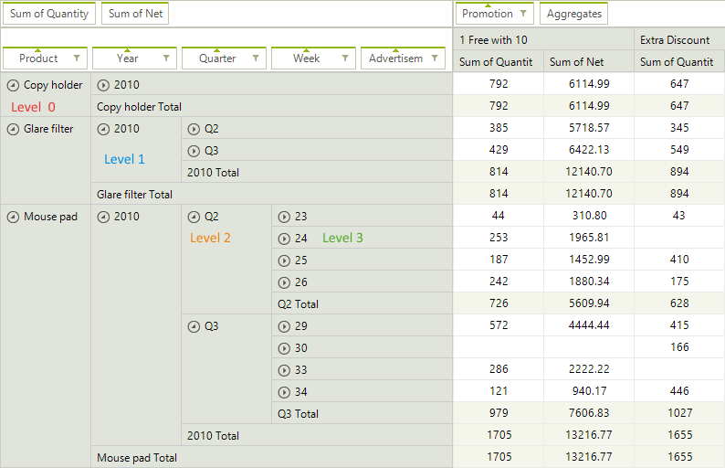

# Expand Behavior

In this article we will show you how to change the initial expand/collapse behavior of __RadPivotGrid__ rows and columns.

>important Initial state is the state of __RadPivotGrid__ after refresh of the used data provider.
>

## GroupsExpandBehavior

In order to control the expand/collapse state of rows and columns in __RadPivotGrid__ you have to use an instance of __GroupsExpandBehavior__ class from *Telerik.Pivot.Core* namespace. It has two properties that you can modify:

* __Expanded__: Bool property which controls the state. When it is *true* the groups will be expanded. When the value is *false* the groups will be collapsed.

* __UpToLevel__: Integer property which controls the levels for which to apply the behavior.

You can combine the two properties to achieve the desired result. The default value of __Expanded__ property is *true*, so if you don't set it (or if you do not set ExpandBehavior), all groups will be expanded. If you do not set __UpToLevel__, the behavior will be applied to all groups (which is its default state). For example, if you set Expanded = false and UpToLevel = 2, all levels up to the set one (levels 0 and 1) will be collapsed, all groups with level greater than or equal to 2 will be expanded. So at initial state you will see all groups collapsed, but if you expand the first two levels, all other groups below them will be expanded.

>caption Figure 1: Group Levels

## Set Expand Behavior

__RadPivotGrid__ has two properties to control the expand behavior - __RowGroupsExpandBehavior__ and __ColumnGroupsExpandBehavior__. As you can guess, the first one controls the expand behavior of the rows and the second one - columns behavior. If you do not set these properties, all groups in rows and columns will be expanded.

#### Expanding Groups

<snippet id='pivotgrid-expandbehavior-expand-cs' />
<snippet id='pivotgrid-expandbehavior-expand-vb' />

## Change Behavior at Run-time

If you want to collapse all groups in __RadPivotGrid__ you can change the behavior at run-time and refresh the data provider to apply the change immediately. For example, you may add two buttons in your application and handle the *Click* event for each of them in order to expand/collapse the groups. Note that the new behavior will be applied each time when the data provider is refreshed.

#### Changing Expand Behavior

<snippet id='pivotgrid-expandbehavior-click-cs' />
<snippet id='pivotgrid-expandbehavior-click-vb' />

# See Also

* [Layout Settings]()
* [End-user Functionalities]()
