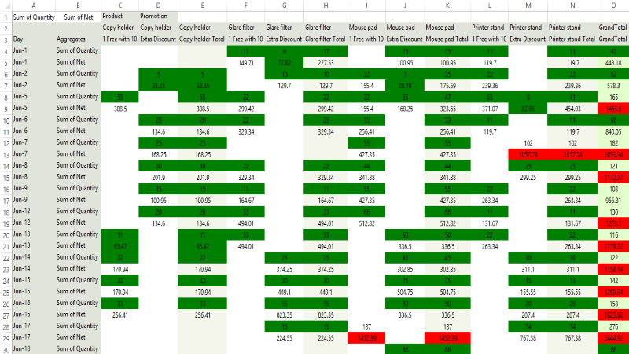

# Export to Excel

This method offers exporting functionality and does not require MS Office installation on users' machines. The __PivotExcelML__ format can be read by MS Excel 2002 (MS Office XP) and above.

>caption Figure 1: RadPivotGrid Export to Excel

## Exporting Data

Before running export to ExcelML, you have to initialize the PivotExportToExcelML class. The constructor takes one parameter: the **RadPivotGrid** that will be exported:

<snippet id='pivotgrid-pivotgridexport-exporttoexcelimlinitialization-cs' />
<snippet id='pivotgrid-pivotgridexport-exporttoexcelimlinitialization-vb' />

## Exporting Visual Settings

Using the PivotExcelML method allows you to export the visual settings (themes) to the Excel file. ExcelML has also a visual representation of the alternating column color. The row height is exported with the default DPI transformation (60pixels = 72points). You can enable exporting visual settings through the ExportVisualSettings property. By default the value of this property is true:

<snippet id='pivotgrid-pivotgridexport-settingexportvisualsettings-cs' />
<snippet id='pivotgrid-pivotgridexport-settingexportvisualsettings-vb' />

## Setting the sheet name

You can specify the sheet name through __SheetName__ property. If your data is large enough to be split on more than one sheet, then the export method adds index to the names of the next sheets.

<snippet id='pivotgrid-pivotgridexport-settingthesheetname-cs' />
<snippet id='pivotgrid-pivotgridexport-settingthesheetname-vb' />

## RunExport method

Exporting data to Excel is done through the __RunExport__ method of  __PivotExportToExcelML__ object. The RunExport method accepts a string parameter with a valid file path. Consider the code sample below:

<snippet id='pivotgrid-pivotgridexport-exporttoexcelinexcelmlformat-cs' />
<snippet id='pivotgrid-pivotgridexport-exporttoexcelinexcelmlformat-vb' />

## Events

__ExcelCellFormating__ event: It gives an access to a single cell’s __SingleStyleElement__ that allows you to make additional formatting (adding border, setting alignment, text font, colors, changing cell value, etc.) for every excel cell related to the exported RadPivotGrid:

<snippet id='pivotgrid-pivotgridexport-excelcellformating-cs' />
<snippet id='pivotgrid-pivotgridexport-excelcellformating-vb' />

# See Also

* [Spread Expot]()
