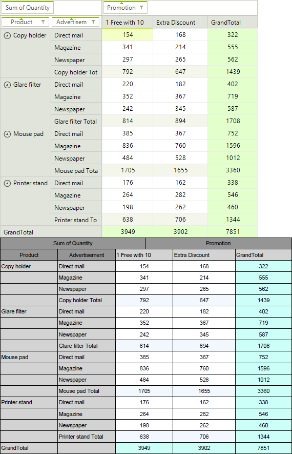

# Export to PDF

__RadPivotGrid__ can export its contents to PDF. This is achieved with the help of the [RadPdfProcessing](http://docs.telerik.com/devtools/document-processing/libraries/radpdfprocessing/overview) library.

>caption Figure 1: RadPivotGrid to PDF

>note The PDF export functionality is located in the __TelerikExport.dll__ assembly and to use the functionality you need yo add reference to it.
>

## Execute the Exporter

Before exporting to PDF, you have to initialize the __PivotGridPdfExport__ class. The constructor takes one parameter - __RadPivotGrid__ which will be exported. You need to create  __PdfExportRenderer__ instance as well:

#### PivotGridPdfExport Class

<snippet id='pivotgrid-pdfexportcode-runexport-cs' />
<snippet id='pivotgrid-pdfexportcode-runexport-vb' />

The __RunExport__ method has several overloads allowing the user to export using a stream as well:

####  Running Export Synchronously Using a Stream

<snippet id='pivotgrid-pdfexportcode-streamrunexport-cs' />
<snippet id='pivotgrid-pdfexportcode-streamrunexport-vb' />

## Properties

* __ExportVisualSettings:__ Gets or sets a value indicating whether the visual settings should be exported.

* __ExportSelectionOnly:__  Gets or sets a value indicating whether to export only selection.

* __ExportFlatData:__ Gets or sets a value which indicates whether to export flat data (collapsed rows and columns).

* __PageSize:__ Gets or sets the page size in millimeters.

* __PageMargins:__  Gets or sets the margins of pages in millimeters.

* __FitToPageWidth:__ Gets or sets a value indicating whether the content of page should fit into the page width.

* __Scale:__ Gets or sets the document scaling. Default value is 1. For example, scale of 1.2f means 20% size increase.

* __ShowHeaderAndFooter:__ Gets or sets a value indicating whether header and footer should be exported.

* __ExportSettings:__ This property allows you to set the [document information](http://docs.telerik.com/devtools/document-processing/libraries/radpdfprocessing/model/radfixeddocument).

The following properties define color and font of the different cell elements: __CellBackColor__, __HeadersBackColor__, __DescriptorsBackColor__, __SubTotalsBackColor__, __GrandTotalsBackColor__, __BorderColor__, __HeaderCellsFont__, __DataCellsFont__

## Events

The __PivotGridPdfExport__ exposes tree events that allows you to change the exported document.

* __CellFormatting:__ This event is fired for every exported cell. It allows you to change the cells properties including its value.

* __CellPaint:__ Occurs after a cell is drawn. This event allows you to draw additional elements to the cell.

* __PdfExported:__ Occurs when the export process completes.

The __PdfExportRenderer__ is exposing two events as well. Detailed information is available here: [PdfExportRenderer]()

## Asynchronous Exporting

The __PivotGrid__ can be exported asynchronously as well. The following example shows how you can run the exporter asynchronously.

#### Running Export Asynchronously

<snippet id='pivotgrid-pdfexportcode-async-cs' />
<snippet id='pivotgrid-pdfexportcode-async-vb' />

The __RunExportAsync__ method has several overloads allowing the user to export using a stream as well:

#### Running Export Asynchronously Overloads

<snippet id='pivotgrid-pdfexportcode-streamrunexportasync-cs' />
<snippet id='pivotgrid-pdfexportcode-streamrunexportasync-vb' />

There are two events that can be used with the asynchronous export:

* __AsyncExportCompleted:__ Occurs when an asynchronous export operation is completed.

* __AsyncExportProgressChanged:__ Occurs when the progress of an asynchronous export operation changes.

# See Also

* [Spread Export]()
