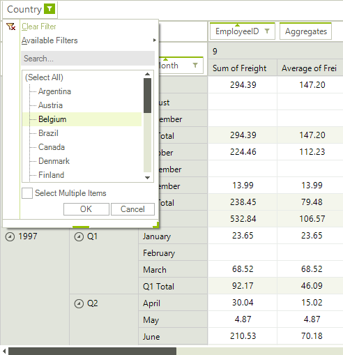
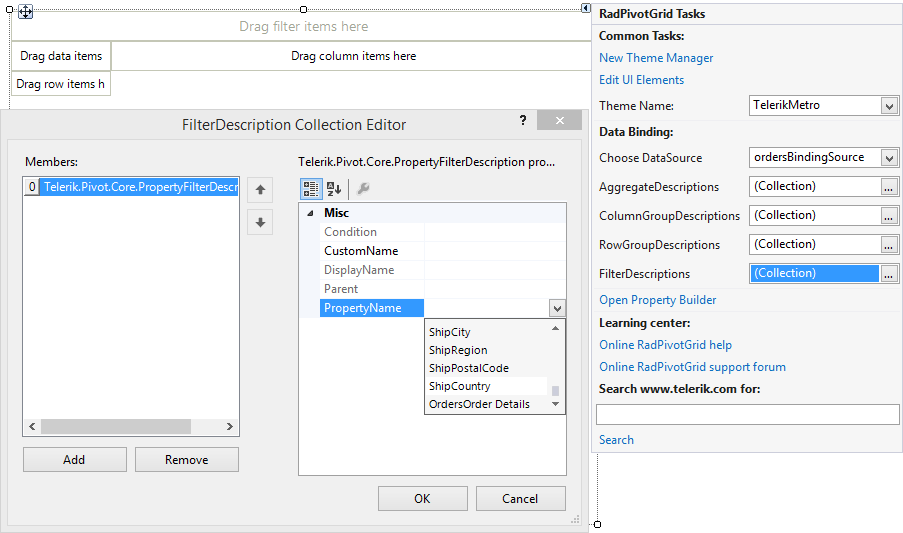

# Report Filters

__RadPivotGrid__ allows you to add filter conditions which describe which items from the data source should be included in the report. These filters are called __Report Filters__. Report filtering occurs before the aggregated information is calculated. This type of filtering is useful when you would like to see a report which concerns only records that share a common property, for example a sales report only for a specified country. 

>caption Figure 1: RadPivotGrid Report Filters 

The report filters are displayed as descriptor elements in the report filters area. This area is hidden by default and in order to show it, you need to set the following property:

#### ShowFilterArea Property

<snippet id='pivotgrid-pivotgridreportfiltering-showfilterarea-cs' />
<snippet id='pivotgrid-pivotgridreportfiltering-showfilterarea-vb' />

The end-user can add/remove report filters by dragging a field to the report filters area or by using the [RadPivotFieldList]().  Additionally, the filter menu opened by the filter button on the filter descriptor elements allows applying different filter conditions. This can be achieved by either selecting/deselecting items from the list box or by using one of the well-known filtering functions (Equals, Contains, Between, etc.).

## Adding a Report Filter Description

Report filter descriptions are stored in the FilterDescriptions collection of RadPivotGrid. You can edit the contents of the collection at design time, using the Smart tag of RadPivotGrid.

>caption Figure 1: Report Filters Designer

The contents of the **FilterDescriptions** collection can also be edited at runtime using code. The __FilterDescriptions__ collection consists of __PropertyFilterDescription__ instances which specify the field on which a filter is applied.

#### Filter Descriptions at Run-time

<snippet id='pivotgrid-pivotgridreportfiltering-propertyfilterdescription-cs' />
<snippet id='pivotgrid-pivotgridreportfiltering-propertyfilterdescription-vb' />

The __Condition__ property of the __PropertyFilterDescription__ holds the currently applied condition. It can be set with a __ComparisonCondition__ instance as shown above or a __SetCondition__ which allows you to include/exclude specific values:

#### Applying Condition

<snippet id='pivotgrid-pivotgridreportfiltering-setcondition-cs' />
<snippet id='pivotgrid-pivotgridreportfiltering-setcondition-vb' />

# See Also

* [Group Filters]()
* [Sorting]()
