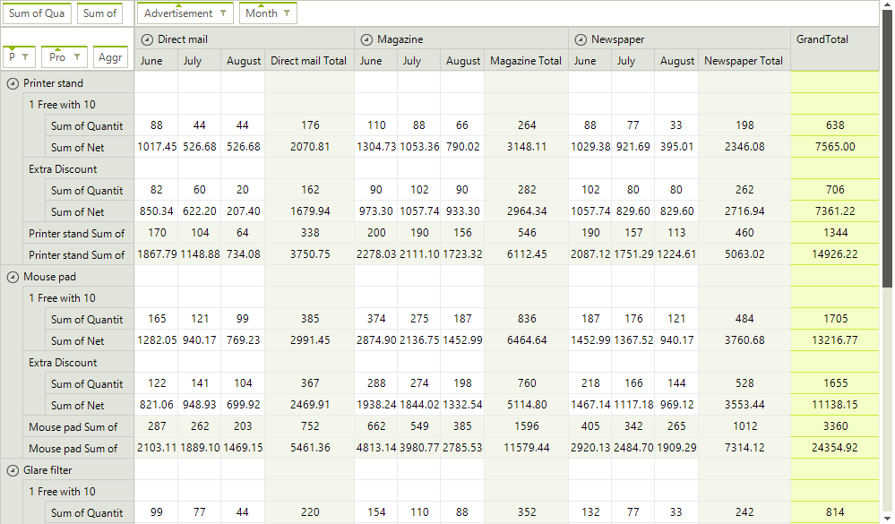
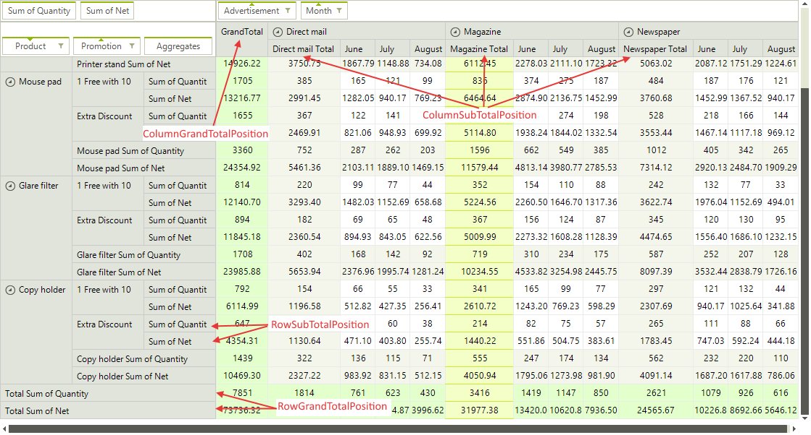
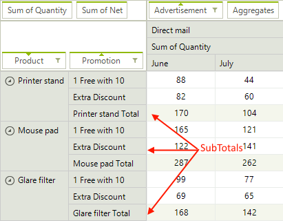
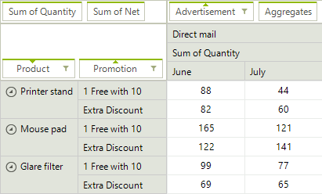
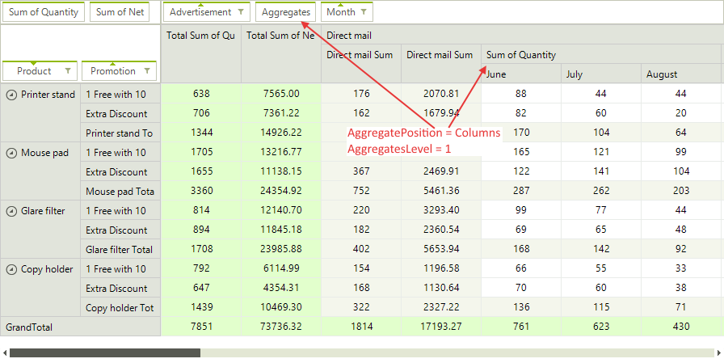

# Layout Settings

**RadPivotGrid** supports two types of layouts - __Tabular__ and __Compact__. The Tabular layout displays each field in a separate rectangle - for row descriptors in a separate column, and for columns descriptors in a separate row. The Compact layout nests the field descriptors in one common rectangle to save up space which can be useful in the cases where a large number of fields is being used.

## Headers

You can control the layout type of the column and row headers via the following properties:

>caption Figure 1: Row and Column Headers Layout

#### Headers Layout

<snippet id='pivotgrid-pivotgridlayoutsettings-layouttype-cs' />
<snippet id='pivotgrid-pivotgridlayoutsettings-layouttype-vb' />

## Sub and Grand Totals

You can also control where SubTotals and GrandTotals are displayed:

>caption Figure 2: Totals Position

#### Set Grand and Sub Totals Position

<snippet id='pivotgrid-pivotgridlayoutsettings-totals-cs' />
<snippet id='pivotgrid-pivotgridlayoutsettings-totals-vb' />

When you set the **RowSubTotalsPosition** and **ColumnSubTotalsPosition** property of the group description to a value different than *None*, the pivot renders the subtotals of the corresponding property group. You can alter this and hide the subtotals for a specific group via the **AutoShowSubTotals** property of the corresponding group description object.

|Row Group with SubTotal| Row Group without SubTotal|
|----|----|
||

#### Hiding Sub Totals

<snippet id='pivotgrid-pivotgridlayoutsettings-hiddensubtotals-cs' />
<snippet id='pivotgrid-pivotgridlayoutsettings-hiddensubtotals-vb' />

## Aggregates

When you have added more than one aggregate description, there are special header cells for each aggregate. To control whether these cells  are displayed in the column headers area or in the row headers area, and also set the level of the aggregate descriptions in the group tree, you can use the following properties:

>caption Figure 4: Aggregates Settings

#### Set Aggregates Level and Position

<snippet id='pivotgrid-pivotgridlayoutsettings-aggregates-cs' />
<snippet id='pivotgrid-pivotgridlayoutsettings-aggregates-vb' />

# See Also

* [Structure]()
* [Formatting Cells]()
