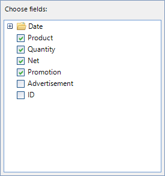
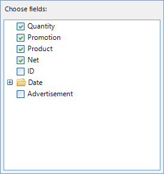
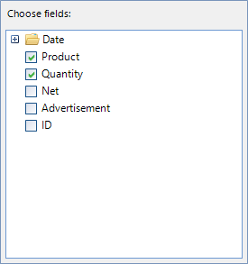
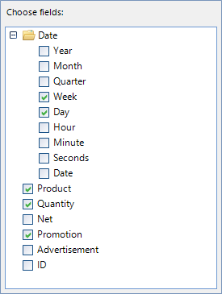
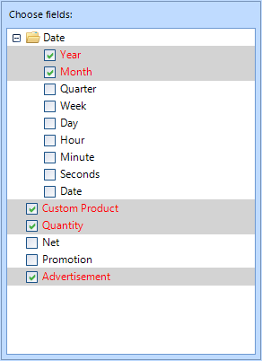

# Customizing RadPivotFieldList

**RadPivotFieldList** can be customized by accessing the elements building its controls or by handling events and define which fields to be extracted and displayed.

## Visual Field Manipulation

__RadPivotFieldList__ internally contains a __RadTreeView__ built with nodes coming from the data source object as fields. The tree can be easily accessed and its elements modified.

| Before Sorting | After Sorting |
| ------ | ------ |
|||

#### Sorting the Nodes

<snippet id='pivotgrid-pivotgridfieldlistcustomizations-sorttree-cs' />
<snippet id='pivotgrid-pivotgridfieldlistcustomizations-sorttree-vb' />

| Before Hiding | After Hiding |
| ------ | ------ |
|||

#### Hiding Nodes

The nodes in the pivot field list are built dynamically so in order to hide a particular node and persist the changes we would need to handle the __UpdateCompleted__ event.

<snippet id='pivotgrid-pivotgridfieldlistcustomizations-subscribetoupdatecompleted-cs' />
<snippet id='pivotgrid-pivotgridfieldlistcustomizations-subscribetoupdatecompleted-vb' />

<snippet id='pivotgrid-pivotgridfieldlistcustomizations-handleupdatecompleted-cs' />
<snippet id='pivotgrid-pivotgridfieldlistcustomizations-handleupdatecompleted-vb' />

## Remove Fields Logically

In the case of a [LocalSourceDataProvider]() object used to populate the items in __RadPivotGrid__, the nodes can be manipulated by handling the __AddingContainerNode__ and __GetDescriptionsDataAsyncCompleted__ events.

#### Setup the Providers

<snippet id='pivotgrid-pivotgridfieldlistcustomizations-setupproviders-cs' />
<snippet id='pivotgrid-pivotgridfieldlistcustomizations-setupproviders-vb' />

| Before Canceling | After Canceling |
| ------ | ------ |
|||

#### Cancel Adding a Particular Node

<snippet id='pivotgrid-pivotgridfieldlistcustomizations-handleaddingcontainernode-cs' />
<snippet id='pivotgrid-pivotgridfieldlistcustomizations-handleaddingcontainernode-vb' />

| Before Removing | After Removing |
| ------ | ------ |
|||

#### Remove a Child Date Node

<snippet id='pivotgrid-pivotgridfieldlistcustomizations-handlegetdescriptionsdataasynccompleted-cs' />
<snippet id='pivotgrid-pivotgridfieldlistcustomizations-handlegetdescriptionsdataasynccompleted-vb' />

## Formatting Nodes

The nodes within the **RadPivotFieldList** can be formatted. You can easily format node elements by handling the **NodeFormatting** event as follows:

<snippet id='pivotgrid-pivotgridfieldlistcustomizations-subscribetonodeformatting-cs' />
<snippet id='pivotgrid-pivotgridfieldlistcustomizations-subscribetonodeformatting-vb' />

Then, introduce the desired customizations to NodeElements:

<snippet id='pivotgrid-pivotgridfieldlistcustomizations-nodeformatting-cs' />
<snippet id='pivotgrid-pivotgridfieldlistcustomizations-nodeformatting-vb' />

|

>note Please note that you should always provide an 'else' clause in the **NodeFormatting** event where you should reset all of the introduced customizations. More information is available [here](https://docs.telerik.com/devtools/winforms/controls/treeview/working-with-nodes/formatting-nodes). 
>

# See Also

* [RadPivotFieldList Overview]()
