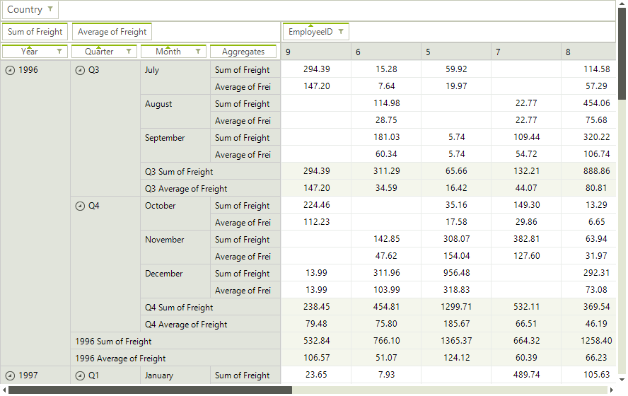

# Using the DataSource Property

Similarly to other WinForms data controls, **RadPivotGrid** can be populated with data by setting its **DataSource** and **DataMember** properties. However, you also need to add the appropriate descriptions in order to define the structure of the data that is going to be displayed. More information about the different types of descriptions can be found in the [Using LocalDataSourceProvider article]()

#### Setting DataSource and DataMember

<snippet id='pivotgrid-pivotgridusingthedatasourceproperty-fillwithdata-cs' />
<snippet id='pivotgrid-pivotgridusingthedatasourceproperty-fillwithdata-vb' />

>note When you set the DataSource and DataMember properties, RadPivotGrid will automatically prepare a **LocalDataSourceProvider** and use it internally.
>

>caption Figure 1: RadPivot Data Binding

# Localizing the Data Provider

The local data source provider is built dynamically while binding **RadPivotGrid** through its **DataSource** property. The data provider can be [localized](https://docs.telerik.com/devtools/winforms/pivotgrid/populating-with-data/using-the-localsourcedataprovider#the-culture-property) by setting its **Culture** property. Since the provider is created on the go, a suitable place to do this job is the handler of the RadPivotGrid.**UpdatedCompleted** event.

#### Setting Culture

<snippet id='pivotgrid-pivotgridusingthedatasourceproperty-localizingdataprovider-cs' />
<snippet id='pivotgrid-pivotgridusingthedatasourceproperty-localizingdataprovider-vb' />

# See Also

* [Smart Tag]()
* [Design Time Data Binding]()
* [Using the LocalSourceDataProvider]()
 
