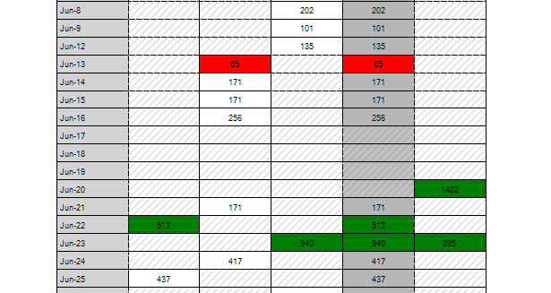

# Events and Customization

**RadPivotGrid** exposes two events which you can use to format the appearance and add custom painting to your printed cells: the __PrintElementFormatting__ and the __PrintElementPaint__ events. The following sample demonstrates how you can mark in __red__ the cells with value that is less than __100__ and in __green__ the cells with value greater than __500__. Additionally, the cells that do not contain any value are grayed out with a hatch brush.

>caption Figure 1: Formatting Print Cells



#### Formatting Print Cells

{{source=..\SamplesCS\PivotGrid\PivotGridPrinting.cs region=Formatting}} 
{{source=..\SamplesVB\PivotGrid\PivotGridPrinting.vb region=Formatting}} 

````C#
private void radPivotGrid1_PrintElementFormatting(object sender, Telerik.WinControls.UI.PrintElementEventArgs e)
{
    PivotCellPrintElement cell = e.PrintElement as PivotCellPrintElement;
    if (cell != null && cell.Value != null && (Convert.ToDouble(cell.Value)) < 100)
    {
        cell.BackColor = Color.Red;
    }
    if (cell != null && cell.Value != null && (Convert.ToDouble(cell.Value)) > 500)
    {
        cell.BackColor = Color.Green;
    }
}
private void radPivotGrid1_PrintElementPaint(object sender, PrintElementPaintEventArgs e)
{
    PivotCellPrintElement cell = e.PrintElement as PivotCellPrintElement;
    if (cell != null && cell.Value == null)
    {
        Brush b = new HatchBrush(HatchStyle.BackwardDiagonal, Color.LightGray, Color.Transparent);
        e.Graphics.FillRectangle(b, e.Bounds);
    }
}

````
````VB.NET
Private Sub radPivotGrid1_PrintElementFormatting(sender As Object, e As Telerik.WinControls.UI.PrintElementEventArgs)
    Dim cell As PivotCellPrintElement = TryCast(e.PrintElement, PivotCellPrintElement)
    If cell IsNot Nothing AndAlso cell.Value IsNot Nothing AndAlso (Convert.ToDouble(cell.Value)) < 100 Then
        cell.BackColor = Color.Red
    End If
    If cell IsNot Nothing AndAlso cell.Value IsNot Nothing AndAlso (Convert.ToDouble(cell.Value)) > 500 Then
        cell.BackColor = Color.Green
    End If
End Sub
Private Sub radPivotGrid1_PrintElementPaint(sender As Object, e As PrintElementPaintEventArgs)
    Dim cell As PivotCellPrintElement = TryCast(e.PrintElement, PivotCellPrintElement)
    If cell IsNot Nothing AndAlso cell.Value Is Nothing Then
        Dim b As Brush = New HatchBrush(HatchStyle.BackwardDiagonal, Color.LightGray, Color.Transparent)
        e.Graphics.FillRectangle(b, e.Bounds)
    End If
End Sub

````

{{endregion}} 

# See Also

* [RadPrintDocument]()
* [PivotGridPrintStyle]()
