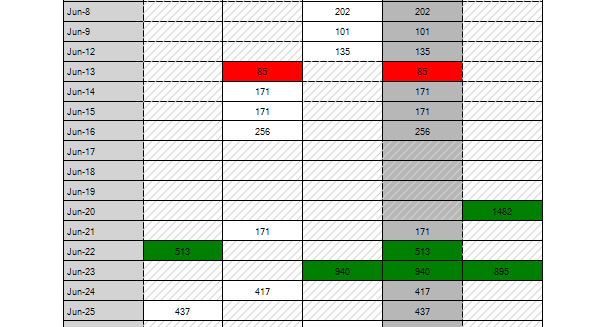

# Events and Customization

**RadPivotGrid** exposes two events which you can use to format the appearance and add custom painting to your printed cells: the __PrintElementFormatting__ and the __PrintElementPaint__ events. The following sample demonstrates how you can mark in __red__ the cells with value that is less than __100__ and in __green__ the cells with value greater than __500__. Additionally, the cells that do not contain any value are grayed out with a hatch brush.

>caption Figure 1: Formatting Print Cells

#### Formatting Print Cells

<snippet id='pivotgrid-pivotgridprinting-formatting-cs' />
<snippet id='pivotgrid-pivotgridprinting-formatting-vb' />

# See Also

* [RadPrintDocument]()
* [PivotGridPrintStyle]()
