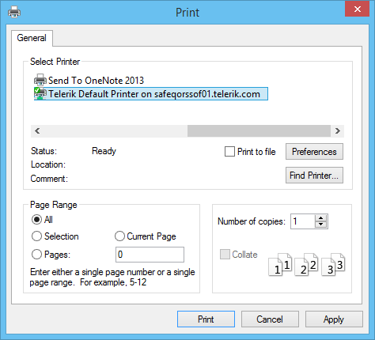

# WinForms PivotGrid Overview

**RadPivotGrid** provides printing support out of the box and this functionality can be customized through a style object, events or with inheritance. **RadPivotGrid** uses the same printing mechanism as RadGridView and RadScheduler and therefore shares the common features provided by [RadPrintDocument](). You can modify the appearance and the layout of the printed pages by using the variety of options provided by the __PivotGridPrintStyle__ class.

RadPivotGrid has two public methods available for printing – __Print__ and __PrintPreview__ methods. The first method will directly send a print job to the default printer with the settings currently saved in the __PrintStyle__ property. This method has one overload available which can show a system __PrintDialog__ with the available printers and their options.

#### Print with Dialog

{{source=..\SamplesCS\PivotGrid\PivotGridPrinting.cs region=Print}} 
{{source=..\SamplesVB\PivotGrid\PivotGridPrinting.vb region=Print}} 

````C#
this.radPivotGrid1.Print();
this.radPivotGrid1.Print(true);

````
````VB.NET
Me.radPivotGrid1.Print()
Me.radPivotGrid1.Print(True)

````

{{endregion}}

>caption Figure 1: Print Dialog



The other available method is __PrintPreview__. It opens a new **RadPrintPreviewDialog** which is discussed in details [here]().

#### Print Preview Dialog

{{source=..\SamplesCS\PivotGrid\PivotGridPrinting.cs region=PrintPreview}} 
{{source=..\SamplesVB\PivotGrid\PivotGridPrinting.vb region=PrintPreview}} 

````C#
this.radPivotGrid1.PrintPreview();

````
````VB.NET
Me.radPivotGrid1.PrintPreview()

````

{{endregion}} 

>caption Figure 2: RadPrintPreviewDialog


# See Also

* [RadPrintDocument]()
* [PivotGridPrintStyle]()
* [Print Events]()
