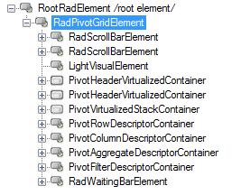
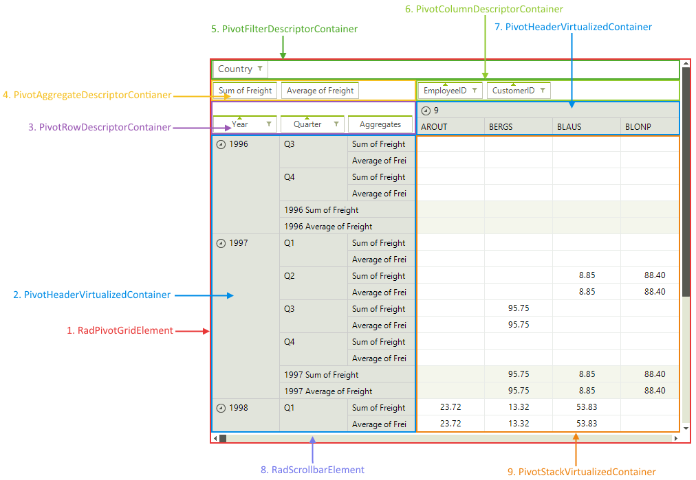

# Structure

This article describes the inner structure and organization of the elements which build the **RadPivotGrid** control.

Like all Telerik WinForms controls **RadPropertyGrid** is build upon [Telerik Presentation Framework (TPF)](). **TPF** consists of various elements (such as primitives and layouts) that are the building blocks of the controls.

>caption Figure 1: RadPivotGrid`s Element Hierarchy

**RadPivotGrid** groups the records in the assigned data source according to column descriptors and row descriptors which are displayed in the __Column descriptors area__ and __Row descriptors area__. What you see in the __Column headers__ and __Row headers__ areas are the group names. Each cell in the Data cells area displays the aggregated result of all records that belong to both groups defined by the row and column of the cell. The aggregate descriptors are displayed in the __Aggregates area__. In the __Report filters area__ you can add fields by which you can filter the displayed results. For example, if you need to see a report of the sales only in the USA, then you can add the Country field to the __Report filters area__ and select USA from its filter menu.

**RadPivotGrid** consists of several different areas and visual elements which have specific purposes and functionality. The structure of the control is described on the following picture.
        
>caption Figure 2: RadPivotGrid`s Element Structure

* **RadPivotGridElement**: Represents the main element of the control.
  * **PivotHeaderVirtualizedContainer**: Represents a virtualized container holding the row and column headers.
  * **PivotRowDescriptorContainer**: Container element of the group row descriptors.
  * **PivotAggregateDescriptorContainer**: Container holding the aggregate elements.
  * **PivotFilterDescriptorContainer**: Container element of the filters.
  * **PivotColumnDescriptorContainer**: Container element of the group column descriptors.
  * **RadScrollbarElement**: Scroll bar element.
  * **PivotStackVirtualizedContainer**: Virtualized container holding the pivot cells.
        
# See Also

* [Smart Tag]()
* [Property Builder]()