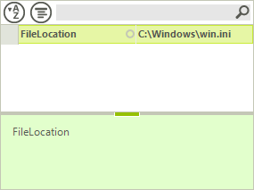
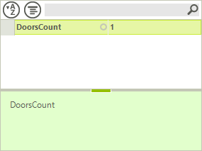
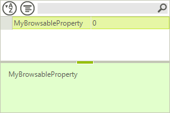
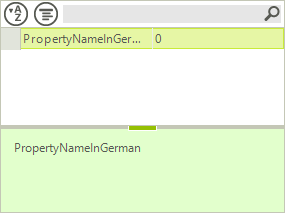
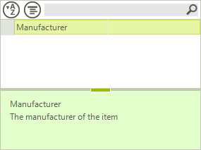
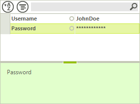
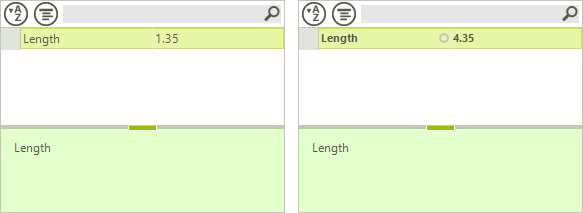
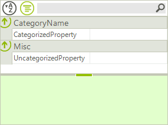
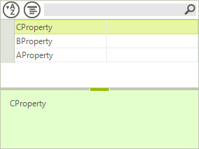
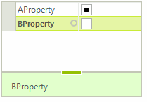

# Attributes

This article contains a list of some of the more important and more commonly used attributes used with RadPropertyGrid.

## EditorAttribute

With the editor attribute you can specify __UITypeEditor__ as well as __BaseInputEditor__ to be used for a given property.

<snippet id='propertygrid-propertygridattributes-editorattribute-cs' />
<snippet id='propertygrid-propertygridattributes-editorattribute-vb' />

>caption Figure 1: EditorAttribute

## RadRangeAttribute 

The range attribute allows you to set a minimum and maximum value to be used for a property that is edited with a RadSpinEditor.

<snippet id='propertygrid-propertygridattributes-radrangeattribute-cs' />
<snippet id='propertygrid-propertygridattributes-radrangeattribute-vb' />

>caption Figure 2: RadRangeAttribute

## BrowsableAttribute  

Determines whether the property will be included in the collection of properties RadPropertyGridSHows.

<snippet id='propertygrid-propertygridattributes-browsableattribute-cs' />
<snippet id='propertygrid-propertygridattributes-browsableattribute-vb' />

>caption Figure 3: BrowsableAttribute

## ReadOnlyAttribute   

Determines whether a property can be edited in RadPropertyGrid or not.

<snippet id='propertygrid-propertygridattributes-readonlyattribute-cs' />
<snippet id='propertygrid-propertygridattributes-readonlyattribute-vb' />

## DisplayNameAttribute

Determines the text that will be show for a given property. You can also alter the text for a property by setting its Label.

<snippet id='propertygrid-propertygridattributes-displaynameattribute-cs' />
<snippet id='propertygrid-propertygridattributes-displaynameattribute-vb' />

>caption Figure 4: DisplayNameAttribute

## DescriptionAttribute

Defines the text that is displayed for a given property in the help bar of RadPropertyGrid.

<snippet id='propertygrid-propertygridattributes-descriptionattribute-cs' />
<snippet id='propertygrid-propertygridattributes-descriptionattribute-vb' />

>caption Figure 5: DisplayNameAttribute

## PasswordPropertyTextAttribute

Determines whether a text property will be edited as a password.

<snippet id='propertygrid-propertygridattributes-passwordpropertytextattribute-cs' />
<snippet id='propertygrid-propertygridattributes-passwordpropertytextattribute-vb' />

>caption Figure 6: PasswordPropertyTextAttribute

## DefaultValueAttribute

Defines the default value to which the property will reset. When the property value is set to something different that the default value, it will be marked as modified.

<snippet id='propertygrid-propertygridattributes-defaultvalueattribute-cs' />
<snippet id='propertygrid-propertygridattributes-defaultvalueattribute-vb' />

>caption Figure 7: DefaultValueAttribute

## CategoryAttribute

Defines the category to which the property will be grouped when properties are shown categorized. Any property that does not have this attribute will be categorized in the Misc category.

<snippet id='propertygrid-propertygridattributes-categoryattribute-cs' />
<snippet id='propertygrid-propertygridattributes-categoryattribute-vb' />

>caption Figure 8: CategoryAttribute

## RadSortOrderAttribute

Defines the order in which items would be ordered when no other ordering is applied (Alphabetical or Categorical alphabetical). The order can also be manipulated through the SortOrder property of PropertyGridItem. Setting the property would override the value from the attribute.

<snippet id='propertygrid-propertygridattributes-radsortorderattribute-cs' />
<snippet id='propertygrid-propertygridattributes-radsortorderattribute-vb' />

>caption Figure 9: RadSortOrderAttribute

## RadCheckBoxThreeStateAttribute

The **RadCheckBoxThreeStateAttribute** determines whether properties inside **RadPropertyGrid**, for which a **PropertyGridCheckBoxItemElement** is created, will have a three state check box editor or a two state one.

<snippet id='propertygrid-propertygridattributes-radcheckboxthreestateattribute-cs' />
<snippet id='propertygrid-propertygridattributes-radcheckboxthreestateattribute-vb' />

>caption Figure 10: RadCheckBoxThreeStateAttribute

## TypeConverterAttribute

The __TypeConverterAttribute__ specifies what type to use as a converter for the object this attribute is bound to. 

<snippet id='propertygrid-propertygridattributes-typeconverterattribute-cs' />
<snippet id='propertygrid-propertygridattributes-typeconverterattribute-vb' />

# See Also

* [Binding to Multiple Objects]()
* [RadPropertyStore - Adding Custom Properties]()
* [Type Converters]()
* [How to Show Nested Collections in RadPropertyGrid]()
