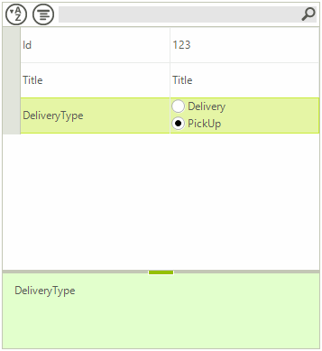

# Custom Items

__RadPropertyGrid__ allows you to create and use your own custom value items, allowing you to add the desired editors to fit your business need. In the following example, we will add two radio buttons as value editor for a property grid item.

>caption Figure 1: Custom Property Grid Item


Let’s start by specifying the RadPropertyGrid.__SelectedObject__ property, so out controls gets populated with some data. For this purpose, we will use the *Item* class which is defined below:

#### Data Class

{{source=..\SamplesCS\PropertyGrid\PropertyGridCustomItems.cs region=ClassItem}} 
{{source=..\SamplesVB\PropertyGrid\PropertyGridCustomItems.vb region=ClassItem}} 

````C#
public class Item
{
    public int Id { get; set; }
    public string Title { get; set; }
    public DeliveryType DeliveryType { get; set; }
    public Item(int id, string title, DeliveryType deliveryType)
    {
        this.Id = id;
        this.Title = title;
        this.DeliveryType = deliveryType;
    }
}
public enum DeliveryType
{
    Delivery,
    PickUp,
}

````
````VB.NET
Public Class Item
    Public Property Id() As Integer
        Get
            Return m_Id
        End Get
        Set(value As Integer)
            m_Id = value
        End Set
    End Property
    Private m_Id As Integer
    Public Property Title() As String
        Get
            Return m_Title
        End Get
        Set(value As String)
            m_Title = value
        End Set
    End Property
    Private m_Title As String
    Public Property DeliveryType() As DeliveryType
        Get
            Return m_DeliveryType
        End Get
        Set(value As DeliveryType)
            m_DeliveryType = value
        End Set
    End Property
    Private m_DeliveryType As DeliveryType
    Public Sub New(id As Integer, title As String, deliveryType As DeliveryType)
        Me.Id = id
        Me.Title = title
        Me.DeliveryType = deliveryType
    End Sub
End Class
Public Enum DeliveryType
    Delivery
    PickUp
End Enum

````

{{endregion}}

Next, we should create a custom __PropertyGridValueElement__ which is purposed to be used in a derived __PropertyGridItemElement__. Our custom implementation of the __PropertyGridValueElement__ will demonstrate how to insert radio buttons for the Item.__DeliveryType__ property.

#### Custom PropertyGridValueElement

{{source=..\SamplesCS\PropertyGrid\PropertyGridCustomItems.cs region=PropertyGridValueElement}} 
{{source=..\SamplesVB\PropertyGrid\PropertyGridCustomItems.vb region=PropertyGridValueElement}} 

````C#
public class CustomPropertyGridValueElement : PropertyGridValueElement
{
    StackLayoutElement stackPanel;
    protected override void CreateChildElements()
    {
        base.CreateChildElements();
        stackPanel = new StackLayoutElement();
        stackPanel.Orientation = Orientation.Vertical;
        foreach (var enumItem in Enum.GetValues(typeof(DeliveryType)))
        {
            RadRadioButtonElement rb = new RadRadioButtonElement();
            rb.Text = enumItem.ToString();
            rb.ToggleStateChanged += rb_ToggleStateChanged;
            stackPanel.Children.Add(rb);
        }
        this.Children.Add(stackPanel);
    }
    private void rb_ToggleStateChanged(object sender, StateChangedEventArgs args)
    {
        RadRadioButtonElement rb = sender as RadRadioButtonElement;
        PropertyGridItem item = this.VisualItem.Data as PropertyGridItem;
        if (item != null && rb.Text != item.FormattedValue && rb.ToggleState == ToggleState.On)
        {
            item.Value = rb.Text;
        }
    }
    public override void Synchronize()
    {
        PropertyGridItem item = this.VisualItem.Data as PropertyGridItem;
        foreach (RadRadioButtonElement rb in stackPanel.Children)
        {
            if (rb.Text == item.FormattedValue)
            {
                rb.ToggleState = ToggleState.On;
                break;
            }
        }
    }
}

````
````VB.NET
Public Class CustomPropertyGridValueElement
Inherits PropertyGridValueElement
    Private stackPanel As StackLayoutElement
    Protected Overrides Sub CreateChildElements()
        MyBase.CreateChildElements()
        stackPanel = New StackLayoutElement()
        stackPanel.Orientation = Orientation.Vertical
        For Each enumItem As Object In [Enum].GetValues(GetType(DeliveryType))
            Dim rb As New RadRadioButtonElement()
            rb.Text = enumItem.ToString()
            AddHandler rb.ToggleStateChanged, AddressOf rb_ToggleStateChanged
            stackPanel.Children.Add(rb)
        Next
        Me.Children.Add(stackPanel)
    End Sub
    Private Sub rb_ToggleStateChanged(sender As Object, args As StateChangedEventArgs)
        Dim rb As RadRadioButtonElement = TryCast(sender, RadRadioButtonElement)
        Dim item As PropertyGridItem = TryCast(Me.VisualItem.Data, PropertyGridItem)
        If item IsNot Nothing AndAlso rb.Text <> item.FormattedValue AndAlso rb.ToggleState = ToggleState.[On] Then
            item.Value = rb.Text
        End If
    End Sub
    Public Overrides Sub Synchronize()
        Dim item As PropertyGridItem = TryCast(Me.VisualItem.Data, PropertyGridItem)
        For Each rb As RadRadioButtonElement In stackPanel.Children
            If rb.Text = item.FormattedValue Then
                rb.ToggleState = ToggleState.[On]
                Exit For
            End If
        Next
    End Sub
End Class

````

{{endregion}}

To put this value element in action, we will create a descendant of __PropertyGridItemElement__, and we will override its __CreatePropertyGridValueElement__ method. In order to avoid reusing of the custom element for other items, you can override the PropertyGridItemElement. __IsCompatible__ method and control whether the custom element is applicable for the specific __PropertyGridItem__ . In addition, it is necessary to create another PropertyGridItemElement which is not compatible with your custom item:

#### Custom PropertyGridItemElements

{{source=..\SamplesCS\PropertyGrid\PropertyGridCustomItems.cs region=PropertyGridItemElement}} 
{{source=..\SamplesVB\PropertyGrid\PropertyGridCustomItems.vb region=PropertyGridItemElement}} 

````C#
public class CustomItemElement : PropertyGridItemElement
{
    protected override PropertyGridValueElement CreatePropertyGridValueElement()
    {
        return new CustomPropertyGridValueElement();
    }
    protected override Type ThemeEffectiveType
    {
        get
        {
            return typeof(PropertyGridItemElement);
        }
    }
    public override bool IsCompatible(PropertyGridItemBase data, object context)
    {
        return data.Label == "DeliveryType";
    }
}
public class DefaultPropertyGridItemElement : PropertyGridItemElement
{
    protected override Type ThemeEffectiveType
    {
        get
        {
            return typeof(PropertyGridItemElement);
        }
    }
    public override bool IsCompatible(PropertyGridItemBase data, object context)
    {
        return data.Label != "DeliveryType";
    }
}

````
````VB.NET
Public Class CustomItemElement
Inherits PropertyGridItemElement
    Protected Overrides Function CreatePropertyGridValueElement() As PropertyGridValueElement
        Return New CustomPropertyGridValueElement()
    End Function
    Protected Overrides ReadOnly Property ThemeEffectiveType() As Type
        Get
            Return GetType(PropertyGridItemElement)
        End Get
    End Property
    Public Overrides Function IsCompatible(data As PropertyGridItemBase, context As Object) As Boolean
        Return data.Label = "DeliveryType"
    End Function
End Class
Public Class DefaultPropertyGridItemElement
    Inherits PropertyGridItemElement
    Protected Overrides ReadOnly Property ThemeEffectiveType() As Type
        Get
            Return GetType(PropertyGridItemElement)
        End Get
    End Property
    Public Overrides Function IsCompatible(data As PropertyGridItemBase, context As Object) As Boolean
        Return data.Label <> "DeliveryType"
    End Function
End Class

````

{{endregion}}

Back to the control, let’s subscribe to the RadPropertyGrid.__CreateItemElement__ event which gives you the opportunity to replace the item created for the __DeliveryType__ property with your custom one:

#### Handle CreateItemElement Event

{{source=..\SamplesCS\PropertyGrid\PropertyGridCustomItems.cs region=CreateItemElement}} 
{{source=..\SamplesVB\PropertyGrid\PropertyGridCustomItems.vb region=CreateItemElement}} 

````C#
private void radPropertyGrid1_CreateItemElement(object sender,
CreatePropertyGridItemElementEventArgs e)
{
    if (e.ItemElementType == typeof(PropertyGridItemElement))
    {
        if (e.Item.Name == "DeliveryType")
        {
            e.ItemElementType = typeof(CustomItemElement);
        }
        else
        {
            e.ItemElementType = typeof(DefaultPropertyGridItemElement);
        }
    }
}

````
````VB.NET
Private Sub radPropertyGrid1_CreateItemElement(sender As Object, e As CreatePropertyGridItemElementEventArgs)
    If e.ItemElementType = GetType(PropertyGridItemElement) Then
        If e.Item.Name = "DeliveryType" Then
            e.ItemElementType = GetType(CustomItemElement)
        Else
            e.ItemElementType = GetType(DefaultPropertyGridItemElement)
        End If
    End If
End Sub

````

{{endregion}}

The next thing we need to do is to stop entering edit mode when clicking over one of the radio buttons by using the RadPropertyGrid.__Editing__ event. Thus, the user will be allowed to select directly the preferred delivery type without necessity to enter edit mode.

#### Handle Editing Event

{{source=..\SamplesCS\PropertyGrid\PropertyGridCustomItems.cs region=Editing}} 
{{source=..\SamplesVB\PropertyGrid\PropertyGridCustomItems.vb region=Editing}} 

````C#
private void radPropertyGrid1_Editing(object sender,
    PropertyGridItemEditingEventArgs e)
{
    if (e.Item.Name == "DeliveryType")
    {
        e.Cancel = true;
    }
}

````
````VB.NET
Private Sub radPropertyGrid1_Editing(sender As Object, e As PropertyGridItemEditingEventArgs)
    If e.Item.Name = "DeliveryType" Then
        e.Cancel = True
    End If
End Sub

````

{{endregion}}

The last thing we should update is to adjust the PropertyGridElement.PropertyTableElement.__ItemHeight__ property with such a value to fit the available content:

#### Set Item Height

{{source=..\SamplesCS\PropertyGrid\PropertyGridCustomItems.cs region=ItemHeight}} 
{{source=..\SamplesVB\PropertyGrid\PropertyGridCustomItems.vb region=ItemHeight}} 

````C#
this.radPropertyGrid1.PropertyGridElement.PropertyTableElement.ItemHeight = Enum.GetValues(typeof(DeliveryType)).Length * 20;

````
````VB.NET
Me.radPropertyGrid1.PropertyGridElement.PropertyTableElement.ItemHeight = [Enum].GetValues(GetType(DeliveryType)).Length * 20

````

{{endregion}}

>note As of R3 2021 SP1 RadPropertyGrid supports individual item's height. As the control does not expose the items directly, there is no Items collection, the data item can be accessed in the **CreateItemElement** or the **ItemFormatting** event. Then, specify the Item.**ItemHeight** property to the desired height.

# See Also

* [Getting Started]()
* [Structure]()
* [Design Time]()
