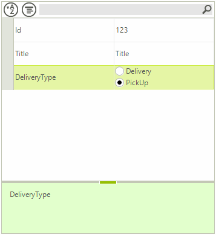

# Custom Items

__RadPropertyGrid__ allows you to create and use your own custom value items, allowing you to add the desired editors to fit your business need. In the following example, we will add two radio buttons as value editor for a property grid item.

>caption Figure 1: Custom Property Grid Item

Let’s start by specifying the RadPropertyGrid.__SelectedObject__ property, so out controls gets populated with some data. For this purpose, we will use the *Item* class which is defined below:

#### Data Class

<snippet id='propertygrid-propertygridcustomitems-classitem-cs' />
<snippet id='propertygrid-propertygridcustomitems-classitem-vb' />

Next, we should create a custom __PropertyGridValueElement__ which is purposed to be used in a derived __PropertyGridItemElement__. Our custom implementation of the __PropertyGridValueElement__ will demonstrate how to insert radio buttons for the Item.__DeliveryType__ property.

#### Custom PropertyGridValueElement

<snippet id='propertygrid-propertygridcustomitems-propertygridvalueelement-cs' />
<snippet id='propertygrid-propertygridcustomitems-propertygridvalueelement-vb' />

To put this value element in action, we will create a descendant of __PropertyGridItemElement__, and we will override its __CreatePropertyGridValueElement__ method. In order to avoid reusing of the custom element for other items, you can override the PropertyGridItemElement. __IsCompatible__ method and control whether the custom element is applicable for the specific __PropertyGridItem__ . In addition, it is necessary to create another PropertyGridItemElement which is not compatible with your custom item:

#### Custom PropertyGridItemElements

<snippet id='propertygrid-propertygridcustomitems-propertygriditemelement-cs' />
<snippet id='propertygrid-propertygridcustomitems-propertygriditemelement-vb' />

Back to the control, let’s subscribe to the RadPropertyGrid.__CreateItemElement__ event which gives you the opportunity to replace the item created for the __DeliveryType__ property with your custom one:

#### Handle CreateItemElement Event

<snippet id='propertygrid-propertygridcustomitems-createitemelement-cs' />
<snippet id='propertygrid-propertygridcustomitems-createitemelement-vb' />

The next thing we need to do is to stop entering edit mode when clicking over one of the radio buttons by using the RadPropertyGrid.__Editing__ event. Thus, the user will be allowed to select directly the preferred delivery type without necessity to enter edit mode.

#### Handle Editing Event

<snippet id='propertygrid-propertygridcustomitems-editing-cs' />
<snippet id='propertygrid-propertygridcustomitems-editing-vb' />

The last thing we should update is to adjust the PropertyGridElement.PropertyTableElement.__ItemHeight__ property with such a value to fit the available content:

#### Set Item Height

<snippet id='propertygrid-propertygridcustomitems-itemheight-cs' />
<snippet id='propertygrid-propertygridcustomitems-itemheight-vb' />

>note As of R3 2021 SP1 RadPropertyGrid supports individual item's height. As the control does not expose the items directly, there is no Items collection, the data item can be accessed in the **CreateItemElement** or the **ItemFormatting** event. Then, specify the Item.**ItemHeight** property to the desired height.

# See Also

* [Getting Started]()
* [Structure]()
* [Design Time]()
