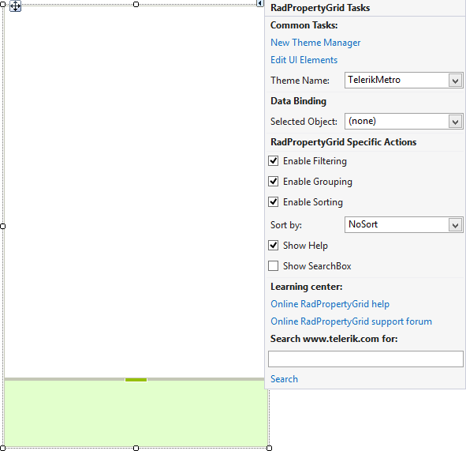

# Design Time

To start using **RadPropertyGrid** just drag it from the toolbox and drop it at the form.

## Smart Tag

Select **RadPropertyGrid** and click the small arrow on the top right position in order to open the Smart Tag.

>caption Figure 1: Smart Tag

* **Common Tasks**

	* **New Theme Manager**: Adds a new __RadThemeManager__ component to the form.

	* **Edit UI elements**: Opens a dialog that displays the *Element Hierarchy Editor*. This editor lets you browse all the elements in the control.
	
	* **Theme Name**: Specifies the theme set to the control.

* **Data Binding**

	* **Selected Object**: Specifies the selected object of the control.

* **RadPropertyGrid Specific Actions**

	* **Enable Filtering**: Enables filtering of the property descriptor items. 

	* **Enable Grouping**: Enables grouping of the property descriptor items.
	
	* **Enable Sorting**: Enables sorting of the property descriptor items.
	
	* **Sort By**: Sets the PropertySort property of the control. The available values are *NoSort*, *Alphabetical*, *Categorized*, and *CategorizedAlphabetical*
	
	* **Show Help**: Displays the description element.
	
	* **Show SearchBox**: Shows the text box responsible for performing a search in the property grid items.

* **Learning Center**: Navigates to the Telerik help, code library projects or support forum.

* **Search**: Searches the Telerik website for a given query.

# See Also

* [Structure]()
* [Getting Started]()
