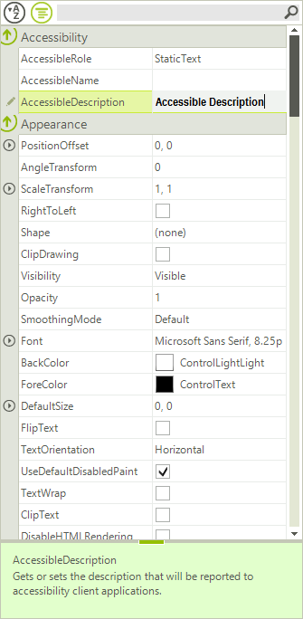

# Customizing Editor Behavior

The appearance and behavior of property grid editors can be changed programmatically. This can be done in the __EditorInitialized__ event. __EditorInitialized__ is fired when the editor is created and initialized with a predefined set of properties.

>caption Figure 1: Customize Editor

The following sample demonstrates how to change the default font of __PropertyGridTextBoxEditor__:

#### Customize editor

<snippet id='propertygrid-propertygridcustomizingeditorbehavior-customizeeditor-cs' />
<snippet id='propertygrid-propertygridcustomizingeditorbehavior-customizeeditor-vb' />

# PropertyGridSpinEditor null values support.

The following snippet shows how you can enable the null values support in the spin editor:

<snippet id='propertygrid-propertygridcustomizingeditorbehavior-nullvalues-cs' />
<snippet id='propertygrid-propertygridcustomizingeditorbehavior-nullvalues-vb' />

# See Also

* [Custom Editors]()
* [Validation]()
* [How to allow end-users to add custom items to PropertyGridDropDownListEditor]()
