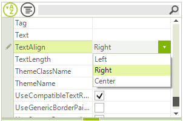
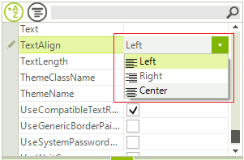

# Handling Editors' Events

## Handling Keyboard Input

In some cases you may need to perform a specific operation depending on the user input in the editor while the editor is still opened.

For example, you may need to set specific text in the editor when the user presses __CTRL + D__. In this case, you should subscribe to the __KeyDown__ event of the __RadTextBoxElement__ in the __EditorInitialized__ event handler. The editors in **RadPropertyGrid** are reused, so we define a field which prevents us from subscribing to the __KeyDown__ more than once.

#### How to Handle Events

{{source=..\SamplesCS\PropertyGrid\Editors\PropertyGridHandlingEditorsEvents.cs region=handlingEvents}} 
{{source=..\SamplesVB\PropertyGrid\Editors\PropertyGridHandlingEditorsEvents.vb region=handlingEvents}} 

````C#
public PropertyGridHandlingEditorsEvents()
{
    InitializeComponent();
    this.radPropertyGrid1.EditorInitialized += new PropertyGridItemEditorInitializedEventHandler(radPropertyGrid1_EditorInitialized);
}
bool tbSubscribed = false;
void radPropertyGrid1_EditorInitialized(object sender, PropertyGridItemEditorInitializedEventArgs e)
{
    PropertyGridTextBoxEditor editor = e.Editor as PropertyGridTextBoxEditor;
    if (editor != null)
    {
        if (!tbSubscribed)
        {
            tbSubscribed = true;
            RadTextBoxElement tbElement = (RadTextBoxElement)editor.EditorElement;
            tbElement.KeyDown += new KeyEventHandler(tbElement_KeyDown);
        }
    }
}
void tbElement_KeyDown(object sender, KeyEventArgs e)
{
    if (e.Control)
    {
        if (e.KeyCode == Keys.D)
        {
            ((RadTextBoxElement)sender).Text = "Default text";
        }
    }
}

````
````VB.NET
Public Sub New()
    InitializeComponent()
    AddHandler RadPropertyGrid1.EditorInitialized, AddressOf radPropertyGrid1_EditorInitialized
End Sub
Private tbSubscribed As Boolean = False
Private Sub radPropertyGrid1_EditorInitialized(ByVal sender As Object, ByVal e As PropertyGridItemEditorInitializedEventArgs)
    Dim editor As PropertyGridTextBoxEditor = TryCast(e.Editor, PropertyGridTextBoxEditor)
    If Not editor Is Nothing Then
        If (Not tbSubscribed) Then
            tbSubscribed = True
            Dim tbElement As RadTextBoxElement = CType(editor.EditorElement, RadTextBoxElement)
            AddHandler tbElement.KeyDown, AddressOf tbElement_KeyDown
        End If
    End If
End Sub
Private Sub tbElement_KeyDown(ByVal sender As Object, ByVal e As KeyEventArgs)
    If e.Control Then
        If e.KeyCode = Keys.D Then
            CType(sender, RadTextBoxElement).Text = "Default text"
        End If
    End If
End Sub

````

{{endregion}}

## Showing Images in PropertyGridDropDownListEditor

If you need to show icons next to the popup items in **PropertyGridDropDownListEditor** you can use the [VisualItemFormatting]() event for the **BaseDropDownListEditorElement** and specify the desired image for the visual items. Subscribe to the **VisualItemFormatting** event in the RadPropertyGrid.**EditorInitialized** event:

|Default PropertyGridDropDownListEditor|PropertyGridDropDownListEditor with Icons|
|----|----|
|||

#### How to Handle Events

{{source=..\SamplesCS\PropertyGrid\Editors\PropertyGridHandlingEditorsEvents.cs region=ShowingIcons}} 
{{source=..\SamplesVB\PropertyGrid\Editors\PropertyGridHandlingEditorsEvents.vb region=ShowingIcons}} 

````C#
private void EditorInitialized(object sender, PropertyGridItemEditorInitializedEventArgs e)
{
    PropertyGridDropDownListEditor editor = e.Editor as PropertyGridDropDownListEditor;
    if (editor != null && e.Item.Name == "TextAlign")
    {
        BaseDropDownListEditorElement element = editor.EditorElement as BaseDropDownListEditorElement;
        element.VisualItemFormatting -= element_VisualItemFormatting;
        element.VisualItemFormatting += element_VisualItemFormatting;
    }
}
private void element_VisualItemFormatting(object sender, VisualItemFormattingEventArgs args)
{
    args.VisualItem.Image = GetImageByText(args.VisualItem.Text);
}
private Image GetImageByText(string align)
{
    if (align == "Left")
    {
        return Properties.Resources.Format_Align_Left;
    }
    else if (align == "Right")
    {
        return Properties.Resources.Format_Align_Right;
    }
    return Properties.Resources.Format_Align_Center;
}

````
````VB.NET
Private Sub EditorInitialized(ByVal sender As Object, ByVal e As PropertyGridItemEditorInitializedEventArgs)
    Dim editor As PropertyGridDropDownListEditor = TryCast(e.Editor, PropertyGridDropDownListEditor)
    If editor IsNot Nothing AndAlso e.Item.Name = "TextAlign" Then
        Dim element As BaseDropDownListEditorElement = TryCast(editor.EditorElement, BaseDropDownListEditorElement)
        AddHandler element.VisualItemFormatting, AddressOf element_VisualItemFormatting
        AddHandler element.VisualItemFormatting, AddressOf element_VisualItemFormatting
    End If
End Sub
Private Sub element_VisualItemFormatting(ByVal sender As Object, ByVal args As VisualItemFormattingEventArgs)
    args.VisualItem.Image = GetImageByText(args.VisualItem.Text)
End Sub
Private Function GetImageByText(ByVal align As String) As Image
    If align = "Left" Then
        Return My.Resources.Format_Align_Left
    ElseIf align = "Right" Then
        Return My.Resources.Format_Align_Right
    End If
    Return My.Resources.Format_Align_Center
End Function

````

{{endregion}}

# See Also

* [Custom Editors]()
* [Customizing Editor Behavior]()
* [Validation]()
