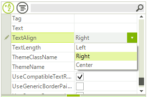
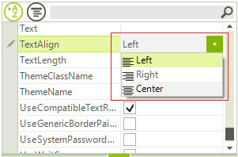

# Handling Editors' Events

## Handling Keyboard Input

In some cases you may need to perform a specific operation depending on the user input in the editor while the editor is still opened.

For example, you may need to set specific text in the editor when the user presses __CTRL + D__. In this case, you should subscribe to the __KeyDown__ event of the __RadTextBoxElement__ in the __EditorInitialized__ event handler. The editors in **RadPropertyGrid** are reused, so we define a field which prevents us from subscribing to the __KeyDown__ more than once.

#### How to Handle Events

<snippet id='propertygrid-propertygridhandlingeditorsevents-handlingevents-cs' />
<snippet id='propertygrid-propertygridhandlingeditorsevents-handlingevents-vb' />

## Showing Images in PropertyGridDropDownListEditor

If you need to show icons next to the popup items in **PropertyGridDropDownListEditor** you can use the [VisualItemFormatting]() event for the **BaseDropDownListEditorElement** and specify the desired image for the visual items. Subscribe to the **VisualItemFormatting** event in the RadPropertyGrid.**EditorInitialized** event:

|Default PropertyGridDropDownListEditor|PropertyGridDropDownListEditor with Icons|
|----|----|
|||

#### How to Handle Events

<snippet id='propertygrid-propertygridhandlingeditorsevents-showingicons-cs' />
<snippet id='propertygrid-propertygridhandlingeditorsevents-showingicons-vb' />

# See Also

* [Custom Editors]()
* [Customizing Editor Behavior]()
* [Validation]()
