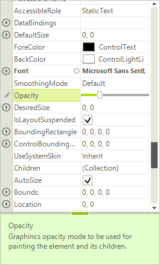

# Using Custom Editor

This following snippet demonstrates how to create and replace the standard spin editor with a track bar editor.

>caption Figure 1: TrackBar Editor



All property grid editors inherit from __BaseInputEditor__. So, you have to inherit from this class and override several methods:

#### Creating Custom Editor

{{source=..\SamplesCS\PropertyGrid\Editors\PropertyGridUsingCustomEditor.cs region=CustomEditor}} 
{{source=..\SamplesVB\PropertyGrid\Editors\PropertyGridUsingCustomEditor.vb region=CustomEditor}} 

````C#
public class PropertyGridTrackBarEditor : BaseInputEditor
{
    public override object Value
    {
        get
        {
            RadTrackBarElement editor = (RadTrackBarElement)this.EditorElement;
            return editor.Value;
        }
        set
        {
            RadTrackBarElement editor = (RadTrackBarElement)this.EditorElement;
            if (value != null && value != DBNull.Value)
            {
                editor.Value = Convert.ToInt32(value);
            }
            else
            {
                editor.Value = 0;
            }
        }
    }
    public override void BeginEdit()
    {
        base.BeginEdit();
        this.EditorElement.Focus();
        ((RadTrackBarElement)this.EditorElement).ValueChanged += new EventHandler(TrackBarEditor_ValueChanged);
    }
    void TrackBarEditor_ValueChanged(object sender, EventArgs e)
    {
        PropertyGridItemElement owner = this.OwnerElement as PropertyGridItemElement;
        if (owner != null)
        {
            owner.PropertyTableElement.RaiseValueChanged(EventArgs.Empty);
        }
    }
    public override bool EndEdit()
    {
        ((RadTrackBarElement)this.EditorElement).ValueChanged -= TrackBarEditor_ValueChanged;
        return base.EndEdit();
    }
    protected override RadElement CreateEditorElement()
    {
        return new RadTrackBarElement();
    }
    public override Type DataType
    {
        get { return typeof(int); }
    }
}

````
````VB.NET
Public Class PropertyGridTrackBarEditor
    Inherits BaseInputEditor
    Public Overrides Property Value() As Object
        Get
            Dim editor As RadTrackBarElement = CType(Me.EditorElement, RadTrackBarElement)
            Return editor.Value
        End Get
        Set(ByVal value As Object)
            Dim editor As RadTrackBarElement = CType(Me.EditorElement, RadTrackBarElement)
            If Not value Is Nothing AndAlso Not value Is DBNull.Value Then
                editor.Value = Convert.ToInt32(value)
            Else
                editor.Value = 0
            End If
        End Set
    End Property
    Public Overrides Sub BeginEdit()
        MyBase.BeginEdit()
        Me.EditorElement.Focus()
        AddHandler (CType(EditorElement, RadTrackBarElement)).ValueChanged, AddressOf TrackBarEditor_ValueChanged
    End Sub
    Private Sub TrackBarEditor_ValueChanged(ByVal sender As Object, ByVal e As EventArgs)
        Dim owner As PropertyGridItemElement = TryCast(Me.OwnerElement, PropertyGridItemElement)
        If owner IsNot Nothing Then
            owner.PropertyTableElement.RaiseValueChanged(EventArgs.Empty)
        End If
    End Sub
    Public Overrides Function EndEdit() As Boolean
        RemoveHandler (CType(Me.EditorElement, RadTrackBarElement)).ValueChanged, AddressOf TrackBarEditor_ValueChanged
        Return MyBase.EndEdit()
    End Function
    Protected Overrides Function CreateEditorElement() As RadElement
        Return New RadTrackBarElement()
    End Function
    Public Overrides ReadOnly Property DataType() As Type
        Get
            Return GetType(Integer)
        End Get
    End Property
End Class

````

{{endregion}}

The __EditorRequired__ event is the correct place to replace the default editor:

#### Replace Editor

{{source=..\SamplesCS\PropertyGrid\Editors\PropertyGridUsingCustomEditor.cs region=replaceEditor}} 
{{source=..\SamplesVB\PropertyGrid\Editors\PropertyGridUsingCustomEditor.vb region=replaceEditor}} 

````C#
void radPropertyGrid1_EditorRequired(object sender, PropertyGridEditorRequiredEventArgs e)
{
    if (e.EditorType == typeof(PropertyGridSpinEditor))
    {
        e.EditorType = typeof(PropertyGridTrackBarEditor);
    }
}

````
````VB.NET
Private Sub radPropertyGrid1_EditorRequired(ByVal sender As Object, ByVal e As PropertyGridEditorRequiredEventArgs)
    If e.EditorType Is GetType(PropertyGridSpinEditor) Then
        e.EditorType = GetType(PropertyGridTrackBarEditor)
    End If
End Sub

````

{{endregion}}

# See Also

* [Customizing Editor Behavior]()
* [Validation]()