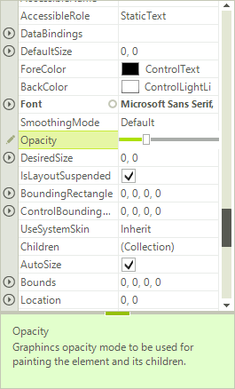

# Using Custom Editor

This following snippet demonstrates how to create and replace the standard spin editor with a track bar editor.

>caption Figure 1: TrackBar Editor

All property grid editors inherit from __BaseInputEditor__. So, you have to inherit from this class and override several methods:

#### Creating Custom Editor

<snippet id='propertygrid-propertygridusingcustomeditor-customeditor-cs' />
<snippet id='propertygrid-propertygridusingcustomeditor-customeditor-vb' />

The __EditorRequired__ event is the correct place to replace the default editor:

#### Replace Editor

<snippet id='propertygrid-propertygridusingcustomeditor-replaceeditor-cs' />
<snippet id='propertygrid-propertygridusingcustomeditor-replaceeditor-vb' />

# See Also

* [Customizing Editor Behavior]()
* [Validation]()
* [How to allow end-users to add custom items to PropertyGridDropDownListEditor]()
