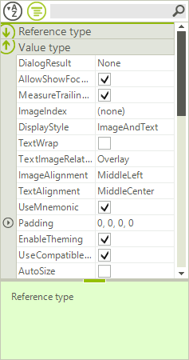

# Custom Grouping

Custom grouping is a flexible mechanism for creating RadPropertyGrid groups by using custom logic. It has a higher priority than the applied __GroupDescriptors__. Grouping is applied if user grouping is enabled through the __RadPropertyGrid.EnableGrouping__ or __PropertyGridElement.EnableGrouping__ properties. By default, grouping is enabled.

You can use the __ItemFormatting__ event to format the group text of the created custom groups.

## Using the CustomGrouping Event

The __CustomGrouping__ event is fired if custom grouping is enabled through the __RadPropertyGrid.EnableCustomGrouping__ or __PropertyGridElement.EnableCustomGrouping__ properties. By default, custom grouping is disabled.

* __PropertyGridTable__: The table while holds the items that will be grouped

* __Item__: The item which group is defined

* __GroupKey__: Identifier of the group

* __Handled__: Defines whether the item is processed by the custom algorithm or by the applied group descriptors.

The following example demonstrates how to handle the __CustomGrouping__ event to group the **RadPropertyGrid** items by the type of the property:

>caption Figure 1: Custom Grouping



#### Custom Grouping

{{source=..\SamplesCS\PropertyGrid\Features\PropertyGridCustomGrouping.cs region=CustomGrouping}} 
{{source=..\SamplesVB\PropertyGrid\Features\PropertyGridCustomGrouping.vb region=CustomGrouping}} 

````C#
public PropertyGridCustomGrouping()
{
    InitializeComponent();
    radPropertyGrid1.SelectedObject = new RadButton();
    radPropertyGrid1.ToolbarVisible = true;
    this.radPropertyGrid1.EnableCustomGrouping = true;
    this.radPropertyGrid1.CustomGrouping += new PropertyGridCustomGroupingEventHandler(radPropertyGrid1_CustomGrouping);
    radPropertyGrid1.ItemFormatting += new PropertyGridItemFormattingEventHandler(radPropertyGrid1_ItemFormatting);
    GroupDescriptor descriptor = new GroupDescriptor("PropertyType");
    this.radPropertyGrid1.GroupDescriptors.Add(descriptor);
}
void radPropertyGrid1_ItemFormatting(object sender, PropertyGridItemFormattingEventArgs e)
{
    PropertyGridGroupItem groupItem = e.Item as PropertyGridGroupItem;
    if (groupItem != null)
    {
        e.Item.Label = groupItem.Group.Key.ToString();
    }
}
private void radPropertyGrid1_CustomGrouping(object sender, PropertyGridCustomGroupingEventArgs e)
{
    Type propertyType = e.Item.PropertyType;
    if (propertyType.IsClass)
    {
        e.GroupKey = "Reference type";
    }
    else
    {
        e.GroupKey = "Value type";
    }
}

````
````VB.NET
Public Sub New()
    InitializeComponent()
    RadPropertyGrid1.SelectedObject = New RadButton()
    RadPropertyGrid1.ToolbarVisible = True
    Me.RadPropertyGrid1.EnableCustomGrouping = True
    Dim descriptor As New GroupDescriptor("PropertyType")
    Me.RadPropertyGrid1.GroupDescriptors.Add(descriptor)
End Sub
Private Sub RadPropertyGrid1_CustomGrouping(ByVal sender As Object, ByVal e As Telerik.WinControls.UI.PropertyGridCustomGroupingEventArgs) Handles RadPropertyGrid1.CustomGrouping
    Dim propertyType As Type = e.Item.PropertyType
    If propertyType.IsClass Then
        e.GroupKey = "Reference type"
    Else
        e.GroupKey = "Value type"
    End If
End Sub
Private Sub RadPropertyGrid1_ItemFormatting(ByVal sender As Object, ByVal e As Telerik.WinControls.UI.PropertyGridItemFormattingEventArgs) Handles RadPropertyGrid1.ItemFormatting
    Dim groupItem As PropertyGridGroupItem = TryCast(e.Item, PropertyGridGroupItem)
    If groupItem IsNot Nothing Then
        e.Item.Label = groupItem.Group.Key.ToString()
    End If
End Sub

````

{{endregion}}

# See Also

* [Filtering]()
* [Grouping]()
* [Sorting]()
* [Editors]()
