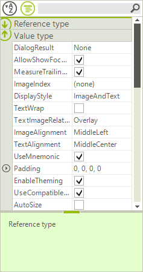

# Custom Grouping

Custom grouping is a flexible mechanism for creating RadPropertyGrid groups by using custom logic. It has a higher priority than the applied __GroupDescriptors__. Grouping is applied if user grouping is enabled through the __RadPropertyGrid.EnableGrouping__ or __PropertyGridElement.EnableGrouping__ properties. By default, grouping is enabled.

You can use the __ItemFormatting__ event to format the group text of the created custom groups.

## Using the CustomGrouping Event

The __CustomGrouping__ event is fired if custom grouping is enabled through the __RadPropertyGrid.EnableCustomGrouping__ or __PropertyGridElement.EnableCustomGrouping__ properties. By default, custom grouping is disabled.

* __PropertyGridTable__: The table while holds the items that will be grouped

* __Item__: The item which group is defined

* __GroupKey__: Identifier of the group

* __Handled__: Defines whether the item is processed by the custom algorithm or by the applied group descriptors.

The following example demonstrates how to handle the __CustomGrouping__ event to group the **RadPropertyGrid** items by the type of the property:

>caption Figure 1: Custom Grouping

#### Custom Grouping

<snippet id='propertygrid-propertygridcustomgrouping-customgrouping-cs' />
<snippet id='propertygrid-propertygridcustomgrouping-customgrouping-vb' />

# See Also

* [Filtering]()
* [Grouping]()
* [Sorting]()
* [Editors]()
